> Notes of **Operation System**  for CUMT final examination 
>
> Created by HJY, CS 2019-04
>
> Last Update Date: May. 10, 2021

# 概论

## 操作系统定义与功能

* ***▲定义***：控制和管理整个计算机系统的软硬件资源，合理地组织、调动计算机的工作与资源的分配，为用户和其他软件提供方便接口与环境的程序和数据的集合。主要任务是对系统中的软硬件实施有效的管理，以提高系统资源（主要包括处理机、主存储器和外存储器、文件系统）的利用率。
* ***▲功能***：
  1. **进程管理（处理机管理）**：多道程序同时运行是现代操作系统最重要最基本的特征，进程管理保证CPU正确地同时运行多道程序。宏观上允许多个进程同时在CPU上执行，但是在微观上一个时刻CPU只能为一个进程服务。
  2. **存储管理**：主要是管理内存资源，需要按照一定的策略为每个程序分配内存与回收内存、保护用户的程序和数据、利用虚拟存储器扩大逻辑空间容量，提高内存利用率。
  3. **设备管理**：管理I/O设备，按照一定策略把外部设备分配给作业、按照一定策略管理输入输出缓冲区、对控制器或通道发出的中断请求及时响应、提供虚拟设备实现多用户多进程共享，提高设备利用率。
  4. **文件管理**：计算机中的信息都是以文件形式存在的，操作系统负责文件管理的部分称为文件系统。文件管理包括文件存储空间的管理、目录管理、文件读写管理和保护等。
  5. 网络通信与服务
  6. 安全与保护
* **作用**：
  * 从资源管理角度：OS作为资源管理器，管理计算机系统硬件与软件资源，对资源状态进行跟踪、分配、回收、保护
  * 从软件分层、扩允机器的观点：OS作为虚拟机，提供硬件的高层界面，取消硬件限制，提供无限的内存、无限的CPU，功能更强大，使用更方便
  * 从服务用户的观点：OS作为用户与裸机接口，提供了命令接口、调用接口、图形接口，使得变成更容易、软件可移植性增强，使用更方便
* **目标**：
  * 有效性（系统管理人员的观点）：管理和分配硬件、软件资源，合理地组织计算机的工作流程
  * 方便性（用户的观点）：提供良好的、一致的用户接口，弥补硬件系统的类型和数量差别
  * 可扩充性与开放性（开放的观点）：硬件类型和规模、操作系统本身的功能和管理策略、多个系统间的资源共享和互操作。

## 操作系统主要特征

* **目的**：提高计算机系统的效率，增强系统的处理能力，充分发挥系统的利用率，方便用户使用。因此现代操作系统普遍采用以*多道程序设计为基础的并行操作技术*。
* ***▲主要特征***：其中并发性和共享性是操作系统最基本的两个特征，两者相互依存。
  1. **并发性**：两个或多个事件在同一时间间隔内发生的、同时处于活动状态的特性。在单处理器多道程序环境下，在一段时间内有多道程序同时处于活跃状态，每个时刻仅能运行一道程序，微观上程序交替运行，是串行的，宏观上程序都在运行，是并发的。而并行是指两个或者多个事件在同一时刻发生。
  2. **共享性**：主要是资源共享。内存中并发运行的多个程序可以共享计算机软硬件资源。包括互斥共享方式和交替共享方式。（并发和共享是操作系统两个最基本的特征，两者互为存在：第一，资源共享是以程序的并发为条件的，若程序不允许程序并发执行，则自然不存在资源共享问题；第二，如果系统不能对资源共享实施有效的管理，则必然影响程序的并发执行，甚至根本无法并发执行）
  3. **虚拟性**：虚拟性是指将一个物理实体映射为若干逻辑对象。物理实体是客观存在的，而逻辑对象是虚构的，是一种感觉上的存在，是主观上的一种标识。操作系统利用多种虚拟技术实现了虚拟处理器（利用多道程序设计技术把一个物理上的CPU虚拟为多个逻辑上的CPU）、虚拟内存（将一台机器的物理存储器变为虚拟存储器，从逻辑上扩充存储器的容量，用户所感觉到的内存容量是虚的）、虚拟外部设备（一台物理I/O设备虚拟为多台，允许每个用户占用一台逻辑上的I/O设备，使原来仅允许在一段时间内由一个用户访问的设备变为在一段时间内允许多个用户同时访问的共享设备）等。
  4. **随机性（异步性）**：程序在何时运行，各个程序的运行顺序，每道程序所需时间都是不确定的，不可预知的，运行结果也是不确定，不可再现的。（多道程序环境下，允许多个程序并发运行，但是只有程序在获得所需资源后才能运行。由于资源有限，程序运行通常是走走停停。内存中每个程序在何时能获得处理器运行，何时因提出某种资源请求而暂停，以及程序按照怎样的速度向前推进，每道程序总共需要多少时间完成都是不可预知的。）

## 操作系统发展

* 手工操作阶段
* 早期批处理阶段
  * 联机批处理：慢速的输入输出处理仍直接由主机来完成。输入输出时，CPU处于等待状态。
  * 脱机批处理：利用卫星机完成输入输出功能。主机与卫星机可并行工作。同一批内各作业的自动依次更替，改善了主机CPU和I/O设备的使用效率，提高了吞吐量。
    * 卫星机：完成面向用户的输入输出，中间结果暂存在磁带或磁盘上。
    * 作业控制命令由监督程序来执行，完成如装入程序、编译、运行等操作。
  * 单道批处理的特征
    * 自动性：磁带上一批作业能自动逐个依次运行，对I/O为主的作业，CPU空闲。
    * 顺序性：作业顺序进入内存,执行与完成的顺序和调入的顺序完全相同。
    * 单道性：内存中仅有一道程序,只有该程序完成或发生异常时,才调入后继程序进入内存运行。
  * 单道批处理的主要问题：一个用户独占全部资源CPU负责计算，也负责传输，CPU与外设速度不匹配。CPU与I/O串行资源利用率仍然很低。
* 多道批处理
  * ***▲多道程序设计原理***：在计算机内存中同时存放几道相互独立的程序，它们在管理程序的控制下交替运行，共享CPU和外设等资源。采用多道程序设计技术的批处理系统称为多道批处理系统。
  * ***▲特征***
    * 多道。同时存在两道或两道以上的程序处于执行的开始点和结束点中间。
    * 宏观并行。都处于运行状态，共同推进。
    * 微观串行。各作业交替使用CPU。
  * ***▲优缺点***
    * 资源利用率高：CPU和内存利用率较高
    * 作业吞吐量大：单位时间内完成工作总量大
    * 用户交互性差：整个作业完成后或中间出错时，才与用户交互，不利于调试和修改
    * 作业平均周转时间长：短作业的周转时间（从作业提交到完成的这段时间）显著增长

## 操作系统接口

* 程序接口（函数接口与系统接口对比联系？）

# 进程管理

## 并发运行与并行运行

* 为了提高系统的操作效率，允许同时运行多个程序，程序的运行不再是顺序的，而是一个程序未运行完，另一个程序便开始运行，内存中同时载入多个相对独立的程序代码，复用/争用CPU等软硬件设备。
* 并发是指多个事件在同一时间间隔发生。在一段时间内，宏观上有多个程序在同时运行，但在单CPU系统中，每个时刻仅能运行一道程序，微观上程序只能是分时交替运行。*这是一种伪并行。*
* 并行是指多个事件在同一时刻发生。如果计算机有多个CPU，并发运行的程序便可以被分配到多个CPU上，实现并行运行。*并行是并发的特例*。

## 并发执行的特征

* **间断（异步）性**：走走停停，一个程序可能走到中途停下来，失去原有的时序关系
* **开放/交互性**：共享/争用资源，受其他程序的控制逻辑的影响。
* **不可再现性**：程序与CPU执行的活动之间不再一一对应，程序经过多次运行，虽然其各次的环境和初始条件相同，但得到的结果却各不相同。

## 进程相关概念与特征

* **程序定义**：特指代码文件，强调其静态性
* ***▲进程定义***：可并发运行的程序在某个数据集合上的一次运行过程，是操作系统资源分配、保护、调度的基本单位（侧重于进程是已经装入内存中运行的程序及其相关数据结构）
* **作业定义**：批处理系统要装入系统运行处理的一系列程序和数据
* ***▲进程特征***
  * 结构性：由程序+数据+进程控制块组成了进程实体，其中进程控制块是进程存在的标志。
  * 动态性：进程是进程实体的执行过程，它由创建而产生，由调度而执行，因某事件而暂停，由撤销而消亡。
  * 并发性：多个进程同时存于内存中，一起向前推进，并发执行。
  * 独立性：进程是独立获得资源和独立调度的基本单位。
  * 异步性：各进程都各自独立的不可预知的速度向前推进。
* ***▲进程与程序的区别***
  * 进程是动态的，程序是静态的：程序是有序代码的集合；进程是程序的执行。通常进程不可在计算机之间迁移；而程序通常对应着文件、静态和可以复制。
  * 进程是暂时的，程序的永久的：进程是一个状态变化的过程，程序可长久保存。
  * 进程与程序的对应关系：通过多次执行，一个程序可对应多个进程；通过调用关系，一个进程可包括多个程序。
  * 进程与程序的组成不同：进程的组成包括程序、数据和进程控制块（即进程状态信息）。

## 进程状态与转换

* ***▲三态图***

  * 运行态：一个进程在处理机上运行
  * 就绪态：一个进程获得了除处理机外的一切所需资源，一旦得到处理机即可运行
  * 阻塞态：一个进程正在等待某一事件发生（例如请求I／O而等待I／O完成等）而暂时停止运行，这时即使把处理机分配给进程也无法运行
  * 就绪→运行：调度程序选择一个新的进程运行
  * 运行→就绪：运行进程用完时间片被中断或在抢占调度方式中, 因为一高优先级进程进入就绪状态
  * 运行→阻塞：进程发生I/O请求或等待某事件时
  * 阻塞→就绪：当I/O完成或所等待的事件发生时

  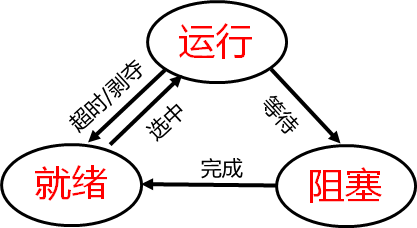

* ***▲五态图***

  * 挂起状态：由于终端用户及操作系统的需要（排除故障或为系统减负），为了能够将指定进程暂时静止下来，增加了静止阻塞（阻塞挂起）和静止就绪（就绪挂起）态，原阻塞和就绪改称为活动阻塞和活动就绪状态。
  
    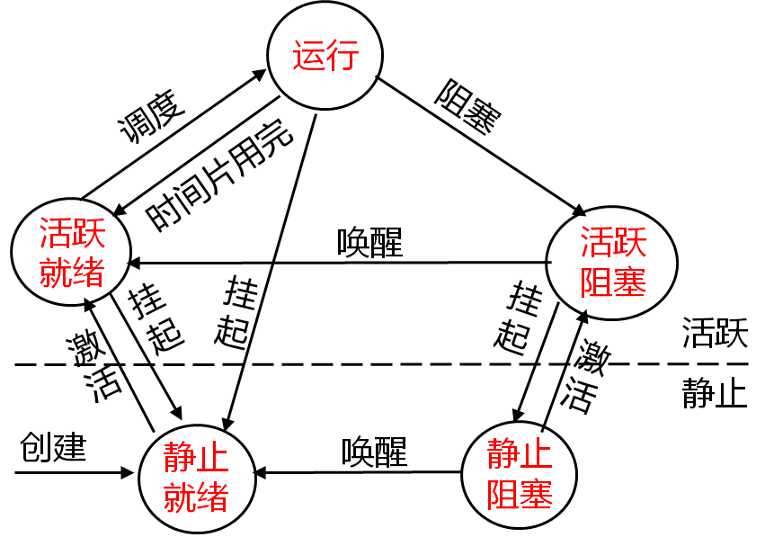

## 进程互斥与同步

* 进程并发执行可能会导致结果不唯一，原因是对共享资源同时进行了访问。串行访问共享资源会顺利执行， 同时访问共享资源会出现错误。

* 并发进程之间有合作关系与竞争关系。合作关系：一组进程协同完成一个任务，它们之间是合作关系（直接制约关系）。竞争关系：多个进程因为使用共享资源而产生竞争关系（间接制约关系）。

* **同步**：*多个进程在执行过程中，为了共享资源与相互合作而在执行次序上的协调*，称为同步，即共享同一资源的进程和相互关联进程以通信手段来保障完成任务时所必须保持一种固定的时间关系。

* **互斥**：当*某一进程访问某一资源时，不允许别的进程同时访问*，这种限制称为互斥，即多个进程在访问某些资源（如临界资源）时，也要有一种执行次序上的协调，当一个进程访问完毕，另一个进程才能访问。所以就其本质来讲，互斥仍是一种同步。

* **临界资源**：一次仅允许一个进程使用的资源。限定了使用者只能互斥地使用它，操作系统也不能中途从抢先者手中把临界资源抢来给其他进程用，是不可剥夺性资源。

* **临界区**：进程中访问临界资源的那段程序代码。为实现对临界资源的互斥访问，应保证诸进程互斥地进入各自的临界区。空则让进，忙则等待，等则有限，等则让权。

* ***信号量***

  * P、V分别代表通过与释放
  * 当S≥0时，表示某类可用资源的数目，或者说表示可以执行P操作而不会被阻塞的进程的数目
  * 当S＜0时，其绝对值表示信号量S的阻塞队列中的进程数，即系统中因请求该类资源而被阻塞的进程的数目，亦即被信号灯挡住的进程数目，这些进程需要别的进程发出相应的信号灯来唤醒。
  * 另外，S的值只能由P、V操作来改变。
  * P(S)操作表示“等信号”，即测试一个要等的信号是否到达；
  * V(S)操作表示“发信号”。这个信号在实现同步时就是“合作者的伙伴进程已完成前趋任务”，在实现互斥时就是“临界资源可用”。
  * 另外，在互斥问题中，每执行一次P(S)操作的含义，也可理解为进程请求一个单位的S类资源；每执行一次V(S)操作的含义，也可理解为进程释放一个单位的S类资源。

  ```c++
  struct semaphore{
    int value；
    struct PCB *Queue;
  };
  
  wait(struct semaphore *s){
      s->value--；
      If  (s->value＜0) block(s->queue);
  };
  
  signal(struct semaphore *s){
     s->value++;
     If (s->value＜=0) wakeup(s->queue);
  };
  ```

## 重要的进程模型

* ***生产者-消费者***

  * **同步**：一旦缓冲池中所有缓冲区均装满产品时，生产者必须等待消费者提供空缓冲区；一旦缓冲池中所有缓冲区全为空时，消费者必须等待生产者提供满缓冲区。

  * **互斥**：缓冲池是临界资源，任何进程在对缓冲区进行存取操作时都必须和其他进程互斥进行。

  * **信号量**

    * 同步信号量`empty`，初值为n，表示消费者已把缓冲池中全部产品取走，有n个空缓冲区可用。
    * 同步信号量`full`，初值为0，表示生产者尚未把产品放入缓冲池，有0个满缓冲区可用。
    * 互斥信号量`mutex`，初值为1，以保证同时只有一个进程能够进入临界区，访问缓冲池。

  ```c++
  item B[k];
  semaphore empty = k;   //可以使用的空缓冲区数
  semaphore full = 0;    //缓冲区内可以使用的产品数
  semaphore mutex = 1;   //互斥信号量
  int in=0;              //放入缓冲区指针
  int out=0;             //取出缓冲区指针 
  cobegin
  process producer_i ( ) {        process consumer_j( ) {    
  	while(true) {            		while(true) {
         produce();              			P(full);
         P(empty);                		P(mutex);
         P(mutex);                		take from B[out];
         append to B[in];         		V(empty);             
         in=(in+1)%k;             		out=(out+1)%k;     
         V(mutex);                		V(mutex);  
         V(full);                 		consume();
  	}                        		}
  }                               }
  coend
  ```

* ***读者-写者***

  * **规则**：多个读者可以同时读这个数据对象，但决不允许多个写者同时对这个数据对象进行写操作，也不允许读者、写者同时访问这个数据对象。
  * **互斥**：写者与写者的互斥、写者与读者的互斥、读者与读者的互斥（访问读者计数器）
  * **信号量**
    * 互斥信号量`ws`，初值为1，用于实现写者与其他写者或读者互斥地访问共享的数据对象。
    * 互斥信号量`mutex`，初值为1，用于实现诸读者互斥地访问读者计数器变量。
    * 整型变量`readcount`，初值为0，用于对读者进行记数。

    ```c++
    int readcount = 0;
    semaphore ws = 1, mutex = 1;
    cobegin
    process reader_i(){              process writer_j(){
    	P(mutex);                    	P(ws);
    	readcount++;                 	write(file);
    	if (readcount==1) P(ws);     	V(ws);
    	V(mutex);                    }
    	read(file);                  
    	P(mutex);                    
    	readcount--;
    	if(readcount==0)V(ws);
    	V(mutex);
    }
    coend
    ```


​    

​    

​    

## 进程通信

## 进程调度算法

* **相关定义**
  * 吞吐量（Throughput）：每单位时间完成的进程数目
  * CPU 利用率（CPU Utilization）：CPU做有效工作的时间/总运行时间
  * **等待时间（Waiting Time）**：一个作业在就绪队列中等待的时间
  * **响应时间（Response Time）**：一个作业提出到回应的时间
  * **周转时间（Turnaround Time）**：一个作业提出到完成的时间
  * **带权周转时间**：一个作业周转时间/所需它的运行时间
  * **平均（带权）周转时间**：就绪队列中所有作业周转时间求和/进程数目（一定大于1）
* 抢占CUP方式：可抢占式（当有比正在运行的进程优先级更高的进程就绪时，系统可强行剥夺正在运行进程的CPU，提供给具有更高优先级的进程使用）、不可抢占式
* 按进程执行过程中的行为划分：I/O密集型（通常会花费很多时间等待I/O操作的完成）、CPU密集型（需要大量的CPU时间进行计算）
* ***▲先来先服务（FCFS, First Come First Serve）***
  * 按照进程就绪的先后顺序使用CPU，实现简单
  * 对长作业有利，对短作业不利。（长进程后面的短进程需要等待长时间，不利于用户体验）
  * 对CUP密集型作业有利，对I/O繁忙型作业不利。（进程I/O阻塞状态结束后需要再次排队，等待重新分配CPU）
  * 非抢占式算法，对响应时间要求高的进程不利

* ***▲最短作业优先（SJF, Shortest Job First）***
  * 具有最短完成时间的进程优先执行
  * 算法易于实现，效率不高，忽视了作业的等待时间
  * 对于长作业不利。（不断接受短作业，可能出现饥饿现象）
  * 非抢占式算法，对响应时间要求高的进程不利。
  * 平均周转时间比FCFS小，性能较好。
  * 需要知道作业所需运行时间，否则调度没有依据。
* ***▲最短剩余时间优先（SRTN, Shortest Remaining Time Next）***
  * SJF抢占式版本，当一个新就绪的进程比当前运行进程具有更短的完成时间时，系统抢占当前进程，选择新就绪的进程执行。
  * 长进程仍可能出现饥饿现象
  * 必须计算运行时间、剩余时间，系统开销增大
  * 因抢占式调度，性能比SJF要好
* **最高相应比优先（HRRN, Highest Response Ratio Next）**
  * 调度时首先计算每个进程的响应比R；之后，总是选择 R 最高的进程执行。
  * 响应比R=周转时间/运行时间=1+(等待时间/运行时间)
* **时间片轮转调度（RR, Round Robin）**
  * 每个进程分配一个时间片，时间片结束，进行周期轮换
  * 为短任务改善平均响应时间
  * 抢占式
  * 时间片较长则退化为FCFS，时间片小则频繁切换，增大系统开销
* **最高优先级调度（HPF, Highest Priority First）**
  * 每次选取优先权高的进程调度，允许抢占
* **多级反馈队列（MFQ, Multiple feedback queue）**
  * 设置多个就绪队列，最高级就绪队列优先级最高，较高优先级就绪队列进程获得较短时间片，新建进程首先进入最高优先级队列，随着得到CPU执行次数增加，逐渐进入较低就绪队列，允许抢占

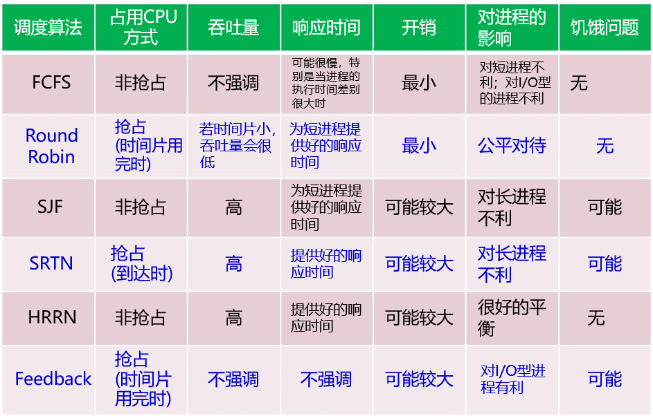

>**例题**
>
>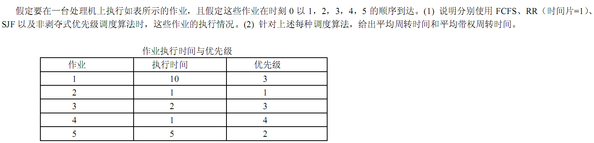
>
>**解答**
>
>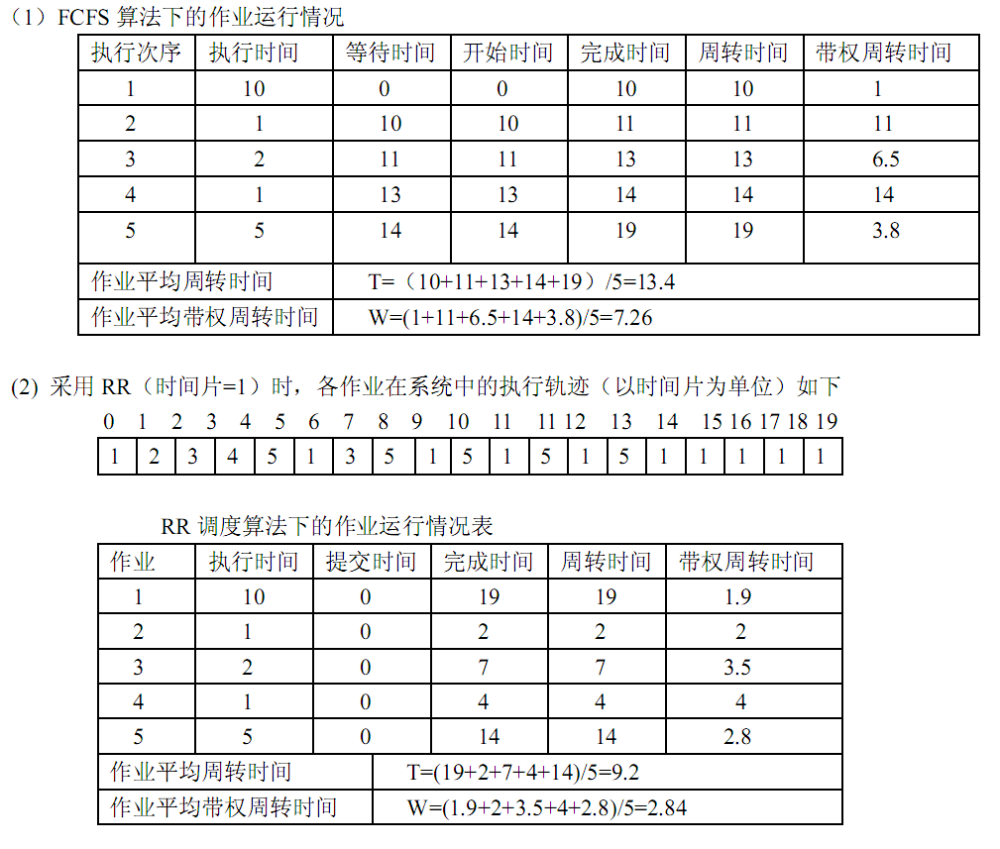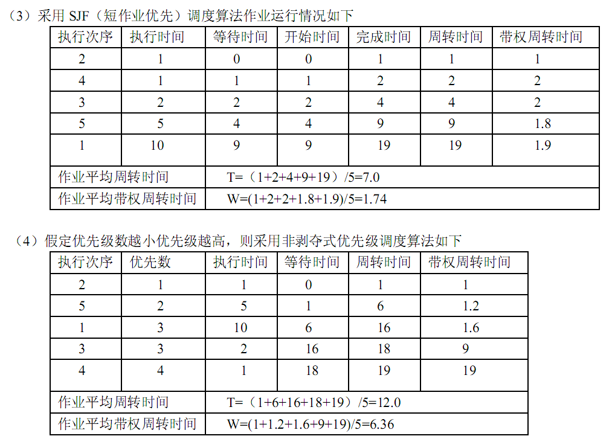

## 死锁

* **定义**：一组进程中，每个进程都无限等待被该组进程中另一进程所占有的资源，因而永远无法得到的资源。死锁的发生会浪费大量系统资源，导致系统崩溃。

* **原因**：并发进程对临界资源的竞争与并发进程推进顺序不当

* ***▲产生死锁的必要条件***（前３个条件是死锁存在的必要条件，而非充分条件，第４个条件是前３个条件同时存在的结果）

  1. **互斥条件（资源独占）**：一个资源每次只给一个进程使用，此时如果有其他进程请求该资源，则请求进程只能等待
  2. **请求并保持条件**：进程在申请新的资源的同时保持对原有资源的占有
  3. **不剥夺条件（不可抢占）**：资源申请者不能强行的从资源占有者手中夺取资源，资源只能由占有者自愿释放
  4. **环路等待条件**：进程等待队列形成一个进程等待环路

* 资源分配图

  * 资源类：方框
  * 资源实例：方框中的点
  * 进程：圆圈
  * 分配边：资源实例→进程
  * 申请边：进程→资源类
  * 死锁定理：如果资源分配图中没有环路，则系统中没有死锁，如果图中存在环路则系统中可能存在死锁。如果每个资源类中只包含一个资源实例，则环路是死锁存在的充分必要条件。

  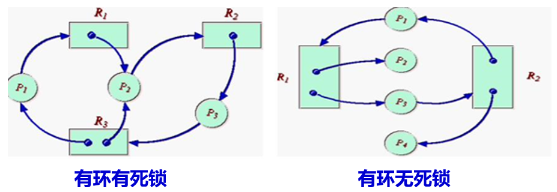

  * 资源分配图化简
    * 找一个非孤立、且只有分配边的进程结点，去掉分配边，将其变为孤立结点
    * 再把相应的资源分配给一个等待该资源的进程，即将该进程的申请边变为分配边
    * 不断重复上述操作，直到进程全部成为孤立结点

* **解决死锁的办法**

  * 鸵鸟算法（不考虑）
  * 不让死锁发生（静态策略：预防，动态策略：避免）
  * 让死锁发生后（死锁的检测与解除）

* **死锁的预防**

  * 破坏互斥使用条件：①依靠资源转换技术，把独占资源变为共享资源。②依靠SPOOLing技术，解决不允许任何进程直接占有打印机的问题
  * 破坏请求与保持条件：①要求每个进程在运行前必须一次性申请它所要求的所有资源，且仅当该进程所要资源均可满足时才给予一次性分配（资源利用率低）②在允许进程动态申请资源前提下规定，一个进程在申请新的资源不能立即得到满足而变为等待状态之前，必须释放已占有的全部资源，若需要再重新申请
  * 破坏不可抢占条件：当一个进程申请的资源被其他进程占用时，可以通过操作系统抢占这一资源（两个进程优先级不同）
  * 破坏循环等待条件：资源有序分配法，把系统中所有资源编号，进程在申请资源时必须严格按资源编号的递增次序进行，否则操作系统不予分配

* **死锁的避免**

  * 在系统运行过程中，对进程发出的每一个系统能够满足的资源申请进行动态检查，并根据检查结果决定是否分配资源，若分配后系统发生死锁或可能发生死锁，则不予分配，否则予以分配。
  * ***▲银行家算法***
    * 绘制一个初始状态矩阵（进程、需求Claim、拥有Procession、缺乏Shortage、可用Available）
    * 绘制一个安全序列（进程、当前可用Current Available、缺乏Shortage、拥有Procession、运行后可用资源Current Available+Procession，可能性判断Possible）
    * 缺点：①进程很难在运行前知道其所需资源的最大值。②系统中各进程之间必须是无关的，即没有同步要求，无法处理有同步关系的进程。③进程的数量和资源的数目是固定不变的，无法处理进程数量和资源数目动态变化的情况。

* **死锁的检测**：当进程由于资源请求不满足而等待时检测死锁（系统开销大）、定时检测、系统资源利用率下降时检测死锁

* **死锁的解除**：重启、撤销、剥夺、回滚

## 线程

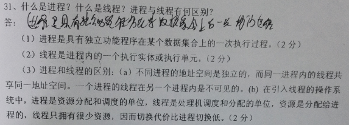

## 管程

* **定义**：定义了一个数据结构和能为并发程序在该数据结构上执行的一组操作，这组操作能同步进程和改变管程中的数据。

* **优点**：把分散在各进程中的临界区集中起来进行管理，防止进程有意或无意的违法同步操作，便于用高级语言来书写程序，也便于程序正确性验证。
* ***对比***
  * 管程定义的是公用数据结构，而进程定义的是私有数据结构
  * 管程把共享变量上的同步操作集中起来，而临界区却分散在每个进程中
  * 管程是为管理共享资源而建立的，进程主要是为占有系统资源和实现系统并发性而引入的
  * 管程是被欲使用共享资源的进程所调用的，管程和调用它的进程不能并行工作，而进程之间能并行工作，并发性是其固有特性
  * 管程是语言或操作系统的成分，不必创建或撤销；而进程有生命周期，由创建而产生至撤销便消亡。

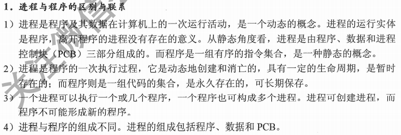


# 内存管理

## 内存管理功能

## 地址表示与转换

## 覆盖与交换技术

## 分区内存管理

## 页式存储管理

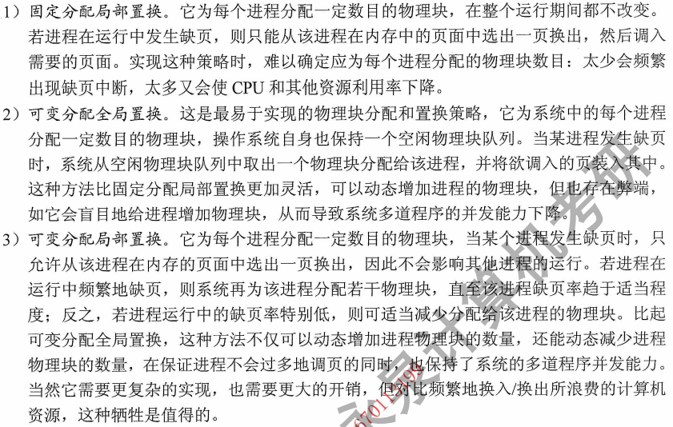

## 段式存储管理

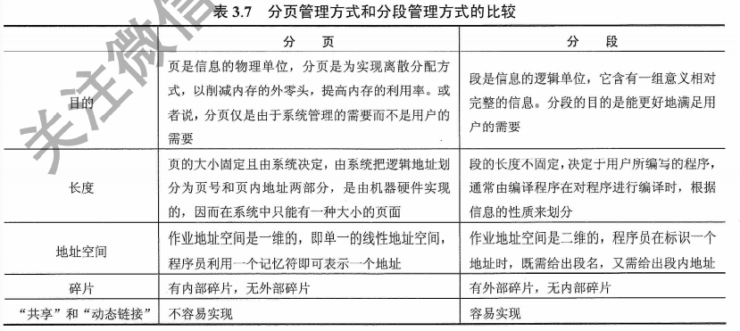

## 虚拟存储技术

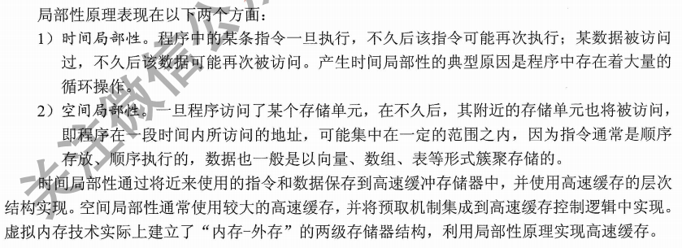

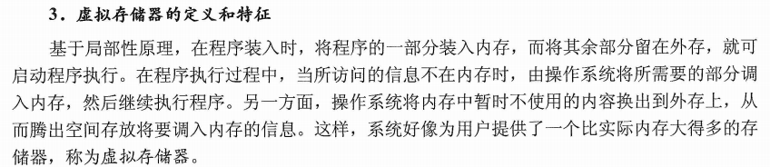

## 请求页式虚拟存储管理

## 请求分段虚拟存储管理

# 设备管理

## 设备分类、功能、结构

## 设备控制方式

* 设备和CPU之间数据传送控制方式
  * 程序循环查询方式（占用CPU时间最多）
  * 中断驱动方式
  * 直接内存访问方式（DMA）
  * 通道方式

## 缓冲技术

## 输入输出软件

## 设备分配回收

# 文件系统

## 文件系统功能


## 文件的组织

## 文件目录

## 文件系统调用的实现

## 文件共享

## 文件系统的体系结构


