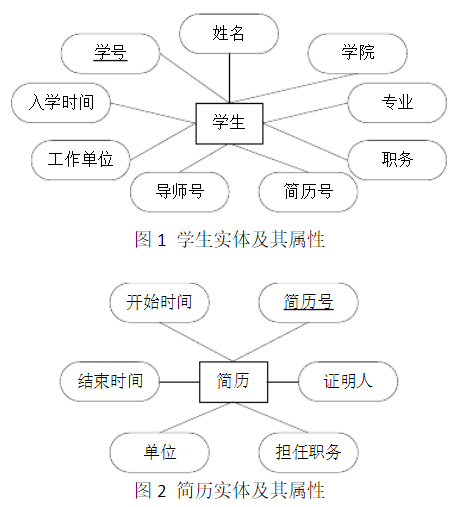
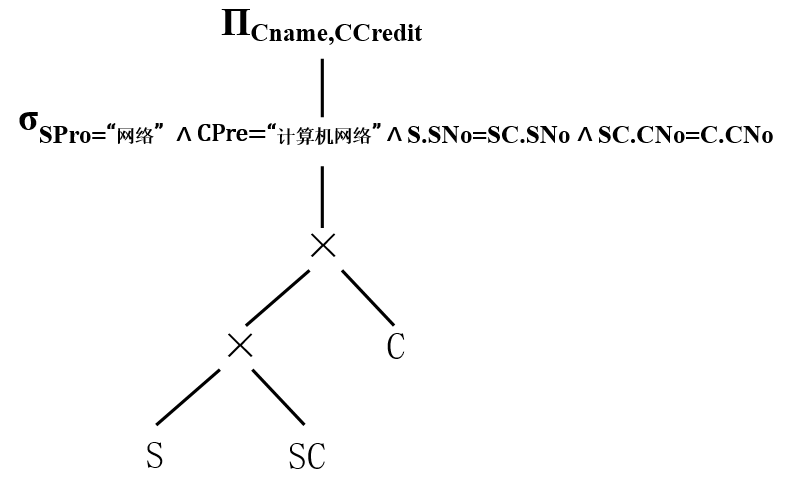
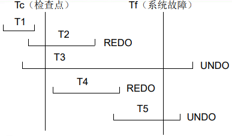
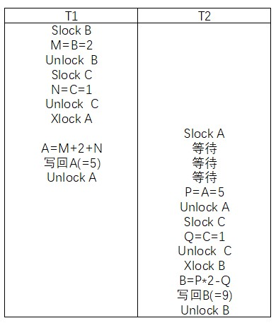

> Notes of **Database Principle** for CUMT final examination 
>
> Created by HJY, CS 2019-04
>
> Last Update Date: May. 9, 2021

# 绪论

## 四个定义

* **数据库（DB）**：在计算机的存储设备上*合理存放、相关联、有结构的数据集合*。
* **数据库管理系统（DBMS）**：*位于用户与操作系统之间的一层数据管理软件*。主要功能是建立和维护数据库，接受和完成用户访问数据库的各种请求。
* **数据库系统（DBS）**：是实现有组织地、动态地存储大量相 关的结构化数据，方便用户使用数据库的计算机软硬件资源的集合。 是指在*计算机系统中引进数据库和数据库管理系统后的组成*。一般由*软件、硬件、数据库、用户*组成。
* **数据库应用系统（DBAS）**：是*数据库系统及其应用程序的组成*，常称应用软件，具有针对某一需求*具体*的实际应用。


## 发展与特点

1. **人工管理阶段**
   * 应用程序管理数据
   * 数据不共享
   * 数据不具有独立性
   * 数据不独立保存
2. **文件系统阶段**
   * 由文件系统管理数据
   * 数据共享性差，冗余度大
   * 数据独立性差
   * 数据可以长期保存
3. **数据库系统阶段**
   * 数据由*DBMS统一管理和控制*
   * 数据的*共享性高*， 数据*冗余度低*，*减少数据不一致性*
   * 较高的*数据独立性*
   * *数据结构化：与文件系统的根本区别*

## 数据模型

* 模型分类：*概念*数据模型、逻辑*数据*模型、*物理*数据模型
* 组成要素：*数据结构、数据操作、数据完整性约束*
* 三个领域：现实世界、信息世界、计算机世界
* 实体标识符：*唯一*确定实体集中某个实体的*最小*实体特性集
* 实体-联系数据模型（*E-R*）是*信息世界*的抽象和建模工具
* 常用结构模型：层次模型、网状模型、*关系模型*（有坚实的理论基础、表达能力强、存取路径透明、数据独立性高、效率低）

| **现实世界** | **信息世界** | **计算机世界** |
| :----------: | :----------: | :------------: |
|    *实体*    |   实体记录   |      记录      |
|   实体特性   |    *属性*    |     *字段*     |
|    实体集    |  实体记录集  |      *表*      |
| *实体标识符* |   标识属性   |    *关键字*    |

>**E-R绘图例题**
>
>对于工程硕士管理需要掌握信息有：学生现在的工作单位、职务、简历情况。其中简历情况包括开始时间、终止时间、单位、担任职务、证明人。学生在校信息包括学号、学院、专业、入学时间、导师。 学生在校课程信息包括：课程号、课程名、学时、授课教师及成绩。学院包括学院代号、名称、院长。导师包括导师职工号、姓名 、出生日期、职称、研究方向。
>
>**答案**
>
>

## 三级结构

* **外部模式（子模式）**：*用户和数据库的接口*，是数据库用户能够看见和使用的局部数据的逻辑结构和特征的描述，一个数据库*可以有多个外部模式*
* **概念模式（模式）**：数据库设计者综合所有用户数据，按照统一的观点构造的对数据库*全局逻辑结构*的描述，*一个数据库只有一个概念模式，同一个外部模式可以多个应用系统使用，一个应用程序使用一个外部模式*
* **内部模式（存储模式）**：对数据库中数据*物理结构和存储方式*的描述，是数据在数据库内部的表示方式，*一个数据库只有一个内部模式*
* 三级模式结构定义了数据库的三个抽象层次：*物理数据库、概念数据库、逻辑数据库*

## 两级映像和数据独立性

* **数据独立性**：数据库系统*在某一层次模式上的改变不会使它的上一层模式也发生改变的过程*。数据独立性包括数据的逻辑独立性和物理独立性两种。*两层映象*保证了数据库外模式的稳定性，从而保证了*应用程序的稳定性*。
* **数据逻辑独立性**：模式发生变化，无需改变外模式或应用程序，*外模式/模式映象*
* **数据物理独立性**：内模式发生变化，无需改变模式及外模式，*模式/内模式映象*


## 用户通过DBMS访问DB过程

1. 接受*应用程序*的数据*请求*
2. *DBMS*对用户的操作请求进行*分析*
3. *数据库管理系统*要向*操作系统*发出操作*请求*
4. *操作系统*接到命令后，对*数据库*中的数据进行*处理*，将结果送到系统*缓冲区*，并发出*读完*标志给*DBMS*
5. *DBMS*接到回答信号后，将缓冲区的数据经过模式映射，变成用户的逻辑记录送到*用户工作区*，同时给用户*回答*成功与否的信息


# 关系数据库

## 关系模型

* 域：一组值的集合，这组值具有相同的数据类型
* 元组（表一行）、分量（元组一部分）、基数（元组个数）、目/度（表数）
* **候选码**：*惟一*标识元组的属性或最小属性集
* **主码**：多个候选码选其中的*一个*为主码（一般不加以说明，码是指主码）
* 包含在*任何一个候选码*中的属性称为**主属性**
* **外码**：F是关系R中的一个或一组属性，但不是R的码，若F与关系S的主码Ks相对应，则称F为R 的外码。关系R为参照关系，关系S为被参照关系/目标关系。

## 关系完整性约束

* **实体完整性规则**：若属性A是基本关系R的主属性，则属性A*不能取空值*。
* **参照完整性规则**：若F是基本关系R的外码，并与S的主码Ks相对应，则对于R中每个元组在F上的值必须为*取空值*或者*取S中主码Ks对应的值*

## 关系代数

* 传统：并、差、交、笛卡尔积
* 专门：选择、投影、连接、自然连接、除
* *基本关系代数运算：并、差、笛卡尔积、选择、投影*
* 运算符的优先级：括号、非、与、或
* 并相容原则：R与S相容，当且仅当*属性数目相同，并且对应属性的域相同*
* 除法RS÷S的意义就是*在联系RS中，找出与S中所有的元组有关系的R元组*

> **例题**
>
> * 学生（学号，姓名，性别，学院，专业方向）
> * 课程（课程号，课程名，先行课，学分）
> * 学习（学号，课程号，成绩）
>
> 1. 查询同时选修了所有课程的学生的学号
> 2. 查询至少选修1号同学选修的所有课程的学生姓名
> 3. 查询选修了1号同学选修的课程的学生姓名
> 4. 查询同时选修1号与2号课程的学生学号
> 5. 查询同时选修D与M课程的学生学号
> 6. 【书例2-16】查询同时选修D与M课程的学生姓名
> 7. 【书例2-17】查询被所有学生都选修的课程名
> 8. 【书例2-18】查询没有选修任何课程的学生名单和所在学院
> 9. 【课后2-11(5)】没有被任何人选修的课程名
> 10. 【课后2-11(9)】求每个学生在已经被学生们选的课程里没有选修的课程，列出学号、课程号
>
> **答案**
> $$
> 1.\pi _{\text{学号},\text{课程号}}\left( \text{学习} \right) \div \pi _{\text{课程号}}\left( \text{课程} \right) 
> \\
> 2.\pi _{\text{课程号},\text{姓名}}\left( \text{学生}\Join \text{学习} \right) \div \pi _{\text{课程号}}\left( \sigma _{\text{学号}=1}\left( \text{学习} \right) \right) 
> \\
> 3.\pi _{\text{姓名}}\left( \pi _{\text{课程号}}\left( \sigma _{\text{学号}=1}\left( \text{学习} \right) \right) \Join \text{学习}\Join \text{学生} \right) 
> \\
> 4.\pi _{\left[ 1 \right]}\left( \sigma _{\left[ 1 \right] =\left[ 4 \right] \land \left[ 2 \right] =1\land \left[ 5 \right] =2}\left( \text{学习}\times \text{学习} \right) \right) 
> \\
> 5.\pi _{\text{学号},\text{课程号}}\left( \text{学习} \right) \div \pi _{\text{课程号}}\left( \sigma _{\text{课程名}=D\lor \text{课程名}=M}\left( \text{课程} \right) \right) 
> \\
> 6.\pi _{\text{姓名},\text{课程号}}\left( \text{学习}\Join \text{学生} \right) \div \pi _{\text{课程号}}\left( \sigma _{\text{课程名}=D\lor \text{课程名}=M}\left( \text{课程} \right) \right) 
> \\
> 7.\pi _{\text{课程名}}\left( \left( \pi _{\text{学号},\text{课程号}}\left( \text{学习} \right) \div \pi _{\text{学号}}\left( \text{学生} \right) \right) \Join \text{课程} \right) 
> \\
> 8\left( 1 \right) .\pi _{\text{姓名},\text{学院}}\left( \left( \pi _{\text{学号}}\left( \text{学生} \right) -\pi _{\text{学号}}\left( \text{学习} \right) \right) \Join \text{学生} \right) 
> \\
> 8\left( 2 \right) .\pi _{\text{姓名},\text{学院}}\left( \text{学生} \right) -\pi _{\text{姓名},\text{学院}}\left( \text{学习}\Join \text{学生} \right) 
> \\
> 9\left( 1 \right) .\pi _{\text{课程名}}\left( \left( \pi _{\text{课程号}}\left( \text{课程} \right) -\pi _{\text{课程号}}\left( \text{学习} \right) \right) \Join \text{课程} \right) 
> \\
> 9\left( 2 \right) .\pi _{\text{课程名}}\left( \text{课程} \right) -\pi _{\text{课程名}}\left( \text{课程}\Join \text{学习} \right) 
> \\
> 10.\pi _{\text{学号},\text{课程号}}\left( \text{学习}\times \text{学生} \right) -\pi _{\text{学号},\text{课程号}}\left( \text{学习} \right)
> $$

## 查询优化

1. 选择下移到笛卡尔以下
2. 投影下移到选择以下，笛卡尔以上
3. 投影下移到笛卡尔以下，选择以上

>**例题**
>
>检索网络方向的学生选修先行课为计算机网络的课程名和课程学分。写出优化前后的语法树。
>
>**答案**
>
>

## 关系系统

* 关系系统：有关系数据结构，支持选择、投影、（自然）连接（运算只需等价功能）
* 按照数据结构三要素程度分类：表式系统（仅支持关系数据结构）、最小关系系统（加上三种关系操作）、关系完备的系统（大多数）、全关系系统


# SQL语言

## 基本表增删改

* **非空和重复**：`NOT NULL`不允许为空值，`UNIQUE`该属性上的值不得重复
* **主关键字**：在列出关系模式的属性时，在属性及其类型后加上保留字`PRIMARY KEY`；或者在列出关系模式的所有属性后，再附加一个声明：`PRIMARY KEY(<属性1> [, <属性2>, …])`（如果关键字由多个属性构成，则*必须*使用第二种方法。）
* **外部关键字**：如果外部关键字只有一个属性，可以在它的属性名和类型后面直接用`REFERENCES <表名>(<属性>)`说明它参照了某个表的某些属性；或者在列出关系模式的所有属性后，增加一个或几个外部关键字说明，用`FOREIGN KEY (<属性>) REFERENCES <表名> (<属性>)`
* 约束类型：`NOT NULL` `UNIQUE` `PRIMARY KEY` `FOREIGN KEY` `CHECK` `DEFAULT`
* 时间日期类型`DATE: MM-DD-YYYY` `TIME: HH:MM:SS`

```mysql
CREATE TABLE Student
( Sno CHAR(8) NOT NULL UNIQUE,
	Sname CHAR(20) UNIQUE,
	Ssex CHAR(2) NOT NULL,
	Sage SMALLINT,
	Sdept CHAR(20),
	PRIMARY KEY (Sno));

CREATE TABLE Course
( Cno CHAR(4) PRIMARY KEY,
	Cname CHAR(20),
	Cpno CHAR(4) REFERENCES Course(Cno), 
	Ccredit SMALLINT);

CREATE TABLE SC
( Sno CHAR(8),
	Cno CHAR(4),
	Grade SMALLINT,
	PRIMARY KEY(Sno,Cno),
	FOREIGN KEY Sno REFERENCES Student(Sno),
	FOREIGN KEY Cno REFERENCES Course(Cno));
```

* 基本表修改和删除

```mysql
ALTER TABLE <表名>
	[ADD <列名><类型>[完整性约束]]
	[DROP <列名>[<完整性约束名>]]
	[ALTER COLUMN <列名> <类型>];

Create table mydb1
(id char(4) not null,
 	sname char(32),
 	sex nvarchar(4),
 	deptid char(32));

ALTER TABLE mydb1
	/*增加名称必须取唯一值的约束条件*/
	ADD Constraint UQ_name UNIQUE (name)
	/*添加表的主键约束*/
	ADD Constraint PK_id primary key (id)
	/*添加表的外约束*/
	ADD Constraint FK_deptid foreign key (deptid) references Dept (deptid)
	/*添加表的Check约束*/
	ADD Constraint CK_sex Check (sex='男'or sex='女')
	/*添加表的Default约束*/
	ADD Constraint DF_sex Default ('F') for sex
	/*删除表*/
	DROP TABLE <表名> [RESTRICT|CASCADE];
```

* 索引的建立和删除

```mysql
CREATE [UNIQUE] [CLUSTERED|NOCLUSTERED] 
	INDEX <索引名> ON <表名> (<列名> [<次序>] [, <列名> [<次序>] … ]);
DROP INDEX <索引名> ON <表名>;
	
CREATE UNIQUE INDEX U_idx_cname ON Course(Cname);
CREATE UNIQUE INDEX SCno ON SC(Sno ASC, Cno DESC);
DROP INDEX stusno ON student;
```

## 单表数据查询（条件与函数）

* **比较**：`=` `<` `>` `<=` `>=` `<>` `!=`
* **范围**：`(NOT) BETWEEN AND`
* **集合**：`(NOT) IN`
* **字符匹配**：`(NOT) LIKE`，`%`代表任意长度字符串，`_`代表任意单个字符，`ESCAPE '/'`可定义斜线用于转义符
* **空值**：`IS (NOT) NULL`
* **多重条件**：`AND` `OR`
* **聚集函数**：`COUNT` `SUM` `AVG` `MAX` `MIN`

```mysql
SELECT [ALL| DISTINCT] 属性1 AS 别名, 属性2 AS 别名…
FROM 表名1, 表名2…
[WHERE 条件表达式]
[GROUP BY 属性1, 属性2 …]
[HAVING 条件表达式]
[ORDER BY 属性1 [ASC|DESC], 属性2 …]

/*查询计算机学院年龄在20岁以下的学生姓名*/
SELECT Sname
FROM Student
WHERE Sdept='计算机' AND Sage<20;

/*查询以“DB_”开头，倒数第三个字符为i的课程的详细信息*/
SELECT *
FROM Course
WHERE Cname like 'DB/_%i__' escape '/';

/*查询选修了2门以上课程的学生学号*/
SELECT Sno
FROM SC
GROUP BY Sno
HAVING COUNT(Cno)>1

/*查询学号在1-4之间至少选修了两门课程的学生学号及其选修的课程数并对课程数降序排序*/
SELECT Sno, COUNT(Cno)
FROM SC
WHERE Sno BETWEEN '1' AND '4'
GROUP BY Sno
HAVING COUNT(Cno)>1
ORDER BY COUNT(Cno) DESC
```

>**例题**
>
>```mysql
>PRODUCT (MAKER, MODEL, TYPE)
>PC (MODEL, SPEED, RAM, HD, CD, PRICE)
>PRINTER (MODEL, COLOR, TYPE, PRICE)
>```
>
>计算生产打印机的各个厂商及其所生产的PC机的硬盘的平均容量。
>
>**解答**
>
>```mysql
>SELECT MAKER, AVG (HD)
>FROM PC, PRODUCT
>WHERE PC.MODEL = PRODUCT.MODEL
>	AND MAKER IN
>		(SELECT MAKER
>		FROM PRODUCT
>		WHERE TYPE= printer )
>GROUP BY MAKER;
>```

## 多表数据查询（连接与嵌套）

```mysql
/*等值与非等值连接查询*/
[<表名1>.] <列名> <比较运算符> [<表名2>.]<列名>
/*自身连接*/
/*外连接*/
右外连接right join ： =（*）
左外连接left join ：（*）=
/*复合条件连接*/
WHERE 子句中可以有多个连接条件
/*集合运算*/
UNION INTERSECT INTERSECT
```

## 简单嵌套查询

```mysql
/*1.带有IN谓词的子查询（不相关子查询）*/
/*查询选修了数据库课程的学生学号和姓名*/
SELECT Sno, Sname
FROM Student
WHERE Sno IN
( SELECT Sno
	FROM SC
	WHERE Cno IN 
	( SELECT Cno
		FROM Course
		WHERE Cname='数据库'));
		
/*查询选修了1号课程而没有选修2号课程的学生学号*/
SELECT Sno
FROM SC
WHERE Cno='1'
AND Sno NOT IN ( 
	SELECT Sno
	FROM SC
	WHERE Cno='2');

/*2.带有比较运算符的子查询（确切知道内查询返回单值时可用比较运算符）*/
/*找出每个学生超过他选修课程平均成绩的课程号*/
SELECT Sno, Cno
FROM SC x
WHERE Grade >=
	(SELECT AVG(Grade) 
	FROM SC y
	WHERE y.Sno=x.Sno);
	
/*3.带有ANY或ALL的子查询（返回多值要用ANY或ALL谓词修饰符，同时使用比较运算符）*/
/*感觉回到了高考学的任意和存在，最大和最小问题，xswl*/
/*查询比计算机学院的学生年龄都小的学生姓名和年龄*/
SELECT Sname, Sage
FROM Student                      等价
WHERE Sage < ALL               WHERE Sage<
	(SELECT Sage                       (SELECT MIN(Sage)
	FROM Student                      FROM Student
	WHERE Sdept='计算机');        WHERE Sdept='计算机')
```

## 含EXISTS查询（嵌套与除法）

* `EXISTS`：*代表存在量词 ，带有`EXISTS`的子查询*不返回任何数据，只产生逻辑真值或逻辑假值。所有带`IN`谓词、比较运算符、`ANY`和`ALL`谓词的子查询都能用带`EXISTS`谓词的子查询等价替换。

* `IN`与`EXISTS`对比：`EXISTS`比`IN`要多一句，里外对应。此外，`IN`先算出*里面*的，求出集合，比较*一次*；而`EXISTS`先算出*外面*的，*每次取一条*，放进内部进行查询，符合条件则输出。

```mysql
-- 查询没有被任何学生选修的课程的课程号
SELECT 课程号
FROM 课程
WHERE 课程号 NOT IN (
	SELECT 课程号
	FROM 学习 );

SELECT 课程号
FROM 课程
WHERE NOT EXISTS (
	SELECT *
	FROM 学习
	WHERE 课程.课程号 = 学习.课程号);
    
-- 求没有选修课程“软件工程”的学生学号和姓名
SELECT 学号, 姓名
FROM 学生
WHERE 学号 NOT IN (
	SELECT 学号
	FROM 学习,课程
	WHERE 学习.课程号 = 课程.课程号
		AND 课程名 = "软件工程");

SELECT 学号, 姓名
FROM 学生
WHERE NOT EXISTS (
    SELECT *
    FROM 学习,课程
    WHERE 学生.学号=学习.学号
    	AND 学习.课程号=课程.课程号
    	AND 课程名="软件工程");
    	
-- 错误写法！！
SELECT DISTINCT 姓名, 学习.学号
FROM 学习, 学生, 课程
WHERE 学习.学号 = 学生.学号
      AND 课程.课程号 = 学习.课程号
      AND 课程.课程名 != '软件工程';
```

***▲除法的写法***

```mysql
/*查询至少选修了1号学生所选全部课程的学生编号*/
/*应该满足not exists (1号所选课程A-x号所选课程B) 为真*/
/*************STEP 1*************用Not Exists表示出A-B******
	SELECT Cno
	FROM SC as A 
	WHERE Sno='1'
		AND not Exists
			(SELECT Cno
			FROM SC as B 
			WHERE Sno＝'x'
				AND A.Cno= B.Cno)
**************STEP 2*********Not Exists（A－B）的表示******
WHERE Not Exists
	(SELECT *
	FROM SC as A 
	WHERE Sno='1'
		AND not Exists
			(SELECT *
			FROM SC as B 
			WHERE Sno＝'x'
				AND A.Cno = B.Cno))
**************STEP 3***************得到查询信息*************/
SELECT Sno
FROM S
WHERE Not Exists
	(SELECT *
	FROM SC as A 
	WHERE Sno='1'
		AND not Exists
			(SELECT *
			FROM SC as B 
			WHERE SC.Sno = B.Sno
				AND A.Cno = B.Cno))
/*查询至少选修了1号学生所选全部课程的学生编号*/
/*另外的思路理解为
有这样一个同学，1号学生选的课程他都选了
也就是：有这样一个同学
（SELECT Sno FROM S）
不存在1号学生选的课程
（Not Exists SELECT * FROM SC WHERE Sno='1'）
该同学没选
（Not Exists SELECT * FROM SC）
最后两条语句连接两个表
（WHERE）
*/
```

>**例题**
>
>【课后3.8(6)】查询全部学生都选修了的课程编号和课程名称
>
>**解答**
>
>```mysql
>/*全部学生都选修了的课程编号和课程名称*/
>SELECT 课程号, 课程名
>FROM C
>WHERE NOT EXISTS 
>	(SELECT *  
>	FROM S AS A
>	WHERE NOT EXISTS   
>		(SELECT *    
>		FROM SC AS B  
>		WHERE B.课程号=C.课程号
>			AND A.学号=B.学号));		
>/*
>理解为：有这样一个课程，所有学生都选了该课程
>也就是：有这样一个课程
>（SELECT 课程号, 课程名 FROM C）
>不存在所有学生
>（Not Exists SELECT * FROM S）
>没选该课程
>（Not Exists SELECT * FROM SC）
>最后两条语句连接两个表
>（WHERE）
>*/
>```

## 数据更新（增删改）

```mysql
/*    1.插入单个元组
INSERT INTO <表名> [(<属性列1>[, <属性列2>…)]
VALUES (<常量1>[, <常量2>]…);
       2.插入子查询结果
INSERT INTO <表名> [(<属性列1>[, <属性列2>…)]
子查询                                                 */

INSERT INTO Student (Sno,Sname,Ssex,Sage,Sdept)
VALUES('4','王磊','男',19,'计算机');

/*对每一个系，求学生的平均年龄，并存入数据库*/
CREATE TABLE Dept_age
(Sdept CHAR(15),
Avg_age SMALLINT);

INSERT INTO Dept_age (Sdept, Avg_age)
SELECT Sdept,AVG(Sage)
FROM Student
GROUP BY Sdept;

/*删除语句的一般格式
DELETE FROM <表名>
[ WHERE <条件> ];
DELETE语句删除表中的数据，
但表的定义仍然留在数据字典中*/

/*删除计算机学院所有学生的选课记录*/
DELETE FROM SC
WHERE Sno IN
	(SELECT Sno
	FROM Student
	WHERE Sdept ='计算机');

/*修改操作语句的一般格式：
UPDATE <表名>
SET <列名>=<表达式> [, <列名>=<表达式>]…
[WHERE <条件> ];*/

/*将计算机学院全体学生的成绩置零*/
UPDATE SC
SET Grade=0
WHERE Sno IN
	(SELECT Sno 
	FROM Student
	WHERE Sdept ='计算机');

/*低于总评均成绩的女同学的成绩提高5%*/
UPDATE SC
SET 成绩=成绩*1.05
WHERE 学号 IN
	(SELECT 学号 FROM S
         WHERE 性别='女')
		AND 成绩 <
			(SELECT AVG(成绩) FROM SC);
```

## 视图

* 视图：从一个或几个基本表（或视图）导出的表（虚表），在数据库中*只存放视图的定义*，而不存放视图的数据。
* 行列子视图：视图从一个基本表导出，并且只是去掉了基本表中的部分行和列，但*保留了原表的主码*
* 分组合聚集函数定义的视图是不可更新的（是被计算出来的）

```mysql
/*建立视图
组成视图的属性列名要么全部省略，要么全部指定
在下列情况下必须列出视图的属性：
1. 某个列不是单纯的属性名，而是聚集函数或表达式；
2. 多表连接时，选出了几个同名列作为视图的字段；
3. 需要在视图中为某个列启用新的名字。    

CREATE VIEW < 视图名>[(<列名>[, <列名>]…)]
AS <子查询>
[WITH CHECK OPTION];                                     */

/*建立计算机学院学生的视图*/
CREATE VIEW CS_VIEW
AS 
	SELECT Sno,Sname,Sdept
	FROM Student
	WHERE Sdept='计算机'
WITH CHECK OPTION

/*建立计算机学院选修1号课程且成绩90以上的
学生视图，包含学号、姓名和成绩*/
CREATE VIEW CS_S1(Sno, Sname, Grade)
AS
	SELECT Student.Sno, Sname, Grade
	FROM Student, SC
	WHERE Sdept= '计算机'
		AND Student.Sno=SC.Sno
		AND Cno='1'
		AND Grade>=90

/*查询视图：
查询计算机学院的视图中年龄小于20岁的学生*/
SELECT Sno,Sage
FROM CS_VIEW
WHERE Sage<20

/*更新视图：
将CS_VIEW中学号为1号的学生姓名改为胡椒*/
UPDATE CS_VIEW
SET Sname='胡椒'
WHERE Sno='1'

/*删除视图*/
DROP VIEW <视图名> [CASCADE]
```

# 关系规范化理论

## 函数依赖

* 函数依赖：属性或属性组之间可能存在的依赖性
* 任意一个给定的X的值，存在唯一的Y值与之对应，则称Y函数依赖与X，或者X函数确定Y，记作X→Y
* **平凡函数依赖**：在R(U)中，一个函数依赖满足Y不包含于X
* **完全（部分）函数依赖**：在R(U)中，如果X→Y，并且对于X的*任何一个*真子集X'，都有X'不能→Y，则称Y对X完全函数依赖，*X(F→)Y*。*存在*真子集X'，则称Y对X部分函数依赖*X(P→)Y*
* **传递函数依赖**：在R(U)中，如果X→Y，Y不包含于X，Y不能→X，Y→Z，则称Z对X传递函数依赖。
* **候选码**：设K为R(U, F)中的属性或属性组，若*U对K完全函数依赖*，则K为R的候选码（*Y=U*，也就是说候选码是可以*唯一确定一个元组的最小属性集合*）


## 四种范式

* **1NF**：关系的每一个分量是不可分的数据项
* **2NF**：满足1NF，且每一个非主属性都完全函数依赖于码
* **3NF**：满足2NF，且每一个非主属性都不传递依赖于码（每一个非主属性既不部分依赖于码，也不传递依赖于码）
* **BCNF**（扩充的3NF）：满足1NF，且*每个决定因素*（也就是所有函数依赖关系箭头左边的的东西）*都包含码*（满足BCNF三个条件：所有非主属性对每一个候选键都是完全函数依赖，所有的主属性对每一个不包含它的候选键也是完全函数依赖，没有任何属性完全函数依赖于非候选键的任何一组属性。）


## 闭包与Armstrong公理

* **闭包（F+）**：在关系模式R(U，F)中F所逻辑蕴含的函数依赖的全体叫做F的闭包。

* **Armstrong公理**：自反律、增广律、传递律、合并规则（X→Y，X→Z，有X→YZ）、伪传递规则（X→Y，WY→Z，有XW→Z）、分解规则（X→Y，Z包含于Y，有X→Z）

* **X关于函数依赖集F的闭包（XF+）**：设F为属性集U上的一组函数依赖，X包含于U，XF+={A|X→A能由F根据Armstrong公理导出}。

* **一个充要推论**：设F为属性集U上的一组函数依赖，XY包含于U，X→Y能由F根据Armstrong公理导出的充要条件是Y包含于XF+。

* ***▲求XF+的算法*：就是看属性X可以根据所给的条件F推导出哪些属性（包括根据已知继续推导的所有属性）。**

## 依赖集等价与最小依赖集

* **依赖集等价**：如果G+=F+，则称F与G等价，记为F≡G。（*指他们的闭包相等*）

* **等价充要条件**：G+=F+充要条件是F包含于G+且G包含于F+。

* **最小依赖集**：如果函数依赖集F满足下列条件，则称F为一个极小函数依赖集，也称最小依赖集或最小覆盖。
  1. （推导出单个）F中任一函数依赖的右部仅含有一个属性。
  2. （依赖不冗余）F中不存在这样的函数依赖X→A，使得F与F-{X→A}等价。
  3. （决定因素不冗余）F中不存在这样的函数依赖X→A，X有真子集Z使得F-{X→A}∪{Z→A}与F等价。

* ***▲最小依赖集的算法***：
  1. **将右部属性分解为单个属性**
  2. **逐个检查F中的每一项，看是否G=F-{X→A}与F等价，也就是每次去掉一个推导关系，看看剩下的新关系G用X能否推导出A，也就是检查是否A∈(X)G+，若成立，去掉这个关系**
  3. **判断每个函数依赖左部是否有冗余属性，如果X由多个属性联合B1B2...Bm，每次去掉一个属性Bi得到X'=X-Bi，看在原来的关系F中用X'能否推出A（这里*不是*把F换成F-{X→A}∪{X'→A}），若A∈(X')F+，则以X-Bi取代X。**

## 码值理论

* **L类**：仅出现在F的函数依赖左部的属性，必是候选码成员

* **R类**：仅出现在F的函数依赖右部的属性，必不是

* **N类**：在F的函数依赖左右两边均未出现的属性，必是候选码成员

* **LR类**：在F的函数依赖左右两边均出现的属性，可能是

* **候选码求解推论**：选取L类和N类，再每次取单个LR类尝试，不行就用多个尝试（我觉得你还不如直接自己推出来）

## 分解的无损连接性判断

* **定义**：分解前的关系模式R和分解后的关系子模式集合ρ，是否表示同样的数据。（分解后需要可以通过自然连接恢复原模式的信息）

* ***▲方法一（通用）***

  构造一个属性总个数n列，分解个数k行的二维表，写aj和bij，根据已知推导关系将左侧都有ai的几个关系右边的bi'j'改成aj'，进行多次，有一排全部改为a即可证明有无损连接性

* ***▲方法二（分解为两个关系的情况）***

  设ρ={R1, R2}是关系模式R的一个分解，F是R的一个函数依赖集，则对于F，ρ具有无损连接性的充分必要条件是：R1∩R2→R1-R2∈F+或R1∩R2→R2-R1∈F+ 中有一个成立即可。

## 分解的函数依赖保持性判断

* **定义**：分解前的关系模式R和分解后的关系子模式集合ρ，是否保持相同的函数依赖
* ***▲方法***
  1. 检验任意一个函数依赖X→Y∈F是否可以由G推导出来（F包含于G+）
  2. 检验任意一个函数依赖X→Y∈G是否可以由F推导出来（定义，必然G包含于F+）
  3. 上述都成立，则具有函数依赖保持性

## 关系模式的分解算法

* **满足3NF的函数依赖保持分解算法**：
  1. R中某些属性与最小覆盖Fm无关，这些关系可以构成一个关系模式
  2. Fm有一个依赖R涉及所有属性，则输出R
  3. 输出一个分解，把条件和能推出的东西放在一起构成一个模式
* **满足3NF的函数依赖保持和无损连接的分解算法**：先求满足3NF依赖保持的分解，看是否包含原关系模式的一个候选码，包含就是，不包含就加上去。

>**例题一**
>
>设关系模式R(ABCD)，函数依赖集F={A→C, C→A, B→AC, D→AC, BD→A}
>
>1. 求出R的候选码。
>2. F的最小函数依赖集。
>3. 将R分解为3NF，使其既具有无损连接性又具有函数依赖保持性。
>
>**解答**
>
>1. BD
>
>2. * A→C: G1={C→A,B→A,B→C,D→A,D→C,BD→A}，(A)G1+=A，A→C不冗余
>   * C→A: G2={A→C,B→A,B→C,D→A,D→C,BD→A}，(A)G2+=C，C→A不冗余
>   * B→A: G3={A→C,C→A,B→C,D→A,D→C,BD→A}，(B)G3+=BCA，B→A冗余
>   * B→C: G4={A→C,C→A,D→A,D→C,BD→A}，(B) G4+=B，B→C不冗余
>   * D→A: G5={A→C,C→A,B→C,D→C,BD→A}，(D) G5+=DCA，D→A冗余
>   * D→C: G6={A→C,C→A,B→C,BD→A}，(D) G6+=D，D→C不冗余
>   * BD→A: G7={A→C,C→A,B→C,D→C}，(BD) G7+=BDCA，BD→A冗余
>   * 由于各函数依赖左部都为单属性，故：Fm={A→C,C→A,B→C,D→C}
>
>3. ρ={R1(AC), R2(BC)，R3(DC)，R4(BD)}（因为关系{AC，BC，DC}不包含候选码，需要加上）
>
>**例题二**
>
>1. F={ AB→C,C→A, C→D } ρ={ACD, BC}
>2. F={ A→B, B→C, C→D } ρ={ACD, AB}
>
>* 确定R的候选码与主码、确定是否为无损分解、确定是否为函数依赖保持、确定ρ中每一个模式的范式级别
>
>**答案**
>
>1. KEY=AB,BC, 无损分解，依赖不保持，均属于BCNF
>2. KEY=A, 无损分解，依赖不保持，AB属于BCNF，ACD属于2NF

# 数据库设计

* **数据库设计**：对于一个给定的应用环境，构造最优的数据库模式，建立数据库及其应用系统，使之能有效地存储数据，满足各种用户的*信息需求（数据库内容及结构的要求，静态）与处理需求（数据库要进行的数据处理，动态）*
* **设计方法**
  * 直观设计法
  * 规范设计法（实体联系、基于3NF、 基于视图概念）
  * 计算机辅助设计法
  * 自动化设计法
* ***设计步骤***
  * 需求分析
  * 概念结构设计
  * 逻辑结构设计
  * 物理结构设计
  * 数据库实施
  * 运行维护

## 需求分析

* **分析重点**：信息要求（DB中需存储的数据）、处理要求（用户要求的处理功能、处理响应时间的要求）、安全性与完整性要求
* **调查需求步骤**：
  1. 分析用户活动，产生业务流程图
  2. 确定系统范围，产生业务范围图
  3. 分析用户活动及所设计的数据，产生数据流图（外部项、数据加工、数据存储、数据流）
  4. 分析系统数据，产生数据字典
* **数据字典**：关于数据库中数据的描述，元数据，而不是数据本身
  * 数据项：是不可再分的数据单位
  * 数据结构：反映数据之间的组合关系
  * 数据流：数据结构在系统内传输的途径
  * 数据存储：数据结构停留或保存的地方，也是数据流的来源和去向之一
  * 处理过程：描述处理过程的说明性信息

## 概念结构设计

* **分类**
  * 自顶向下（集中模式设计）
  * 自底向上（视图集成法）
  * 混合策略（自底向上和自顶向下相结合）
  * 逐步扩张（由内向外法）
* **局部视图设计**：通常以中层数据流图设计分E-R图（实体、属性、联系）
* **集成全局视图**
  * 属性冲突 （属性域冲突、取值单位冲突）
  * 命名冲突（同名异义、异名同义）
  * 结构冲突 

## 逻辑结构设计

* E-R图转换为关系模式，实质是将实体和联系转为关系模式。
* ***▲转换规则***：
  * **一对一**
    * 转换为新关系，每个实体的码均是该关系的候选码。
    * 与任意一端模式合并。在该关系模式中加入另一关系的码和联系的属性，该关系的码不变。
  * **一对多/多对一**
    * 转换为新关系。 与该联系相连的各实体的码以及联系本身的属性构成新关系的属性，该关系的码是n端关系模式的码。
    * 与n端模式合并。在n端关系模式中加入1端关系模式的码和联系的属性，关系的码仍为n端关系的码。
  * **多对多**
    * 与该联系相连的各实体的码以及联系本身的属性构成新关系的属性，该关系的码是两端关系模式码的组合。
* **逻辑结构优化**：确定范式级别、实施规范化管理

>**例题**
>
>设计一个学校的图书管理系统， 请给出该系统的需求分析并进行数据库设计，具体要求为：
>
>1. 实体数不少于 5 个，每个实体的属性 3--6 个，实体之间的关系至少要包含 1:n,m:n两种联系类型。
>2. 给出该系统的 E-R 图。
>3. 将 E-R 图转换为一组符合 3NF 要求的关系模式，并标识主外键（用加粗标识主码，用正红色标识外键）。
>
>**解答**
>
>
>
>
>
>* 图书（**图书编号**，书名，作者姓名，出版社，出版日期，在库数，入库日，出库日期，*书库编号*）
>* 借阅者（**借阅证号**，姓名，*学院编号*，借书数量）
>* 管理员（**管理员编号**，姓名，职称，*书库编号*）
>* 书库（**书库编号**，书库名称，地点）
>* 学院（**学院编号**，学院名称）
>* 借阅（***借阅证号，图书编号***，借出日期，归还日期，到期日期，拖欠日期，罚款数目）
>* 管理（***管理员编号，借阅证号***）
>* 处理（***管理员编号，图书编号***）

# 数据库保护

* **数据库保护功能**：备份与恢复、并发控制、安全性控制、完整性控制

* **事务**：是一个不可分割的操作序列，该操作序列要么全做，要么全不做，一个程序可以有多个事务。

* **事务特性（ACID）**

  * 原子性（Atomicity）不可分割的工作单位
  * 一致性（Consistency）事务提交后，从一个一致性状态到另一个一致性状态
  * 隔离性（Isolation）事务完成前，结果不能被其它事务引用
  * 持续性（Durability）事务执行成功，其对数据产生的效果永久有效

* **事务执行五种状态**：活动、部分提交、失败、中止

  

## 数据库恢复

* **基本原理**：建立冗余

* **恢复技术**：常用建立冗余方法包括数据转储、日志文件

  1. 数据转储

     * 转储类型：静态转储（能保证副本与数据库的一致性，但是效率太低）、动态转储（效率高，但不能保证副本与数据库的一致性）
     * 转储方式：海量转储（每次转储数据库中的全部数据）、增量转储（每次转储上一次转储后更新过的数据）

  2. 日志文件

     * 格式：事务标识、操作类型、对象标识、前像、后像
     * 事务开始、修改、插入、删除、提交、回滚
     * **原则一**：登记的次序必须严格按照并发事务*执行*的次序（不是提交）
     * **原则二**：*必须先写日志，后写数据库*，并且日志文件和数据库文件不能和数据库文件放在同一个磁盘上
     * 事务故障恢复和系统故障恢复必须用日志文件
     * 在动态转储方式中必须建立日志文件，后备副本和日志文件结合才能有效恢复数据库。静态也可以建立。
  
* **故障类型及其恢复**：

  * 事务故障：反向扫描日志文件，将日志中更新前的数据写回到数据库中，直至事务的开始标志

  * 系统故障：撤销故障发生时未完成的事务，重做已完成的事务

  * 介质故障：DBA利用数据库副本和日志文件副本进行恢复

  * 具有检查点的恢复策略（减少重做次数）

    

>**例题**
>
>设某数据库系统在运行过程中发生了故障，发生故障时正在运行的事务有T1、T2、T3、T4、T5和T6。进行故障恢复时，发现事务T1、T4和T5有事务开始记录而没有事务提交记录；事务T2、T3和T6有事务开始记录和事务提交的结束记录，但T3和T6对数据库的修改还没有写到数据库中，请给出一个恢复方案。
>
>**解答**
>
>1. T1：扫描到T1时，将T1加入撤销队列
>2. T2：不处理
>3. T3：扫描到T3时，将T3加入重做队列
>4. T4：扫描到T4时，将T4加入撤销队列
>5. T5：扫描到T5时，将T5加入撤销队列
>6. T6：扫描到T6时，将T6加入重做队列

## 并发控制

* **导致问题**：丢失修改（WW冲突）、不可重复读（RW冲突，包括修改的读不一致和插入删除的幻影读现象）、读脏数据（WR冲突，一个事务读取了另一个未提交事务的数据）
* **代数表示**：Ri(X)表示事务Ti的读X操作，Wi(X)表示事务Ti的写X操作
* **冲突操作**：如果两个操作来自不同的事务，它们对同一数据单位进行操作，并且其中至少有一个是写操作， 则称这两个操作是相互冲突的或冲突操作

* **串行/并发调度**：串行调度事务执行的结果总是正确的，但是不能够充分利用系统资源。并发调度各个事务交叉地执行，但是不一定正确。
* **可串行化**：一个事务集的并发调度与某一串行调度是等价的，可串行化是作为并发调度正确与否的判定准则
* **冲突可串行化定理**：一个调度Sc在保证*冲突操作*的次序不变情况下，通过交换两个事务*不冲突操作*的次序得到另一个调度Sc'， 如果Sc'是串行的称调度Sc为冲突可串行化调度
* **前驱图（冲突可串行化的判定方法）**：V是由所有参加调度的事务构成的节点，E是图中的一条有向边，如果Oi和Oj是冲突操作，且Oi先于Oj执行，则在图中有一条边Ti→Tj，如果得到无环的前趋图，则是可串行化的
* **拓扑图（获得调度S的一个等价的串行调度）**：数据结构，去线法（输出一个入度为0的顶点，然后删除此顶点，并删除以次顶点为尾的弧）

> **例题**
>
> 设T1、T2是如下两个事务：T1：A:=B+2+C，T2： B:=A*2-C。假设初始值A=2，B=2，C=1。
>
> 1. 若两个事务允许并行执行，有多少种可能的正确执行结果，请列举出来。
> 2. 请给出一个可串行化调度及其结果。
>
> **解答**
>
> 1. 两种
>
>    * T1-T2 结果A=5 B=9
>    * T2-T1 结果A=6 B=3
>
> 2. 对于T1-T2：A=5 B=9 C=1。
>
>    

## 封锁技术

* **排它锁（X锁，写锁）**：若事务T对数据对象A加上排它锁，则只允许T读取和修改A，*不允许其他任何事务再对A加任何锁*，直到T释放A上的X锁

* **共享锁（S锁，读锁）**：若事务T对数据对象A加上共享锁，则事务T可以读A但不能修改A，其他事务只能对A加S锁，*而不能加X锁*，直到T释放A上的S锁

* **封锁协议**

  | 级别 |                  加锁                  |      放锁       |
  | :--: | :------------------------------------: | :-------------: |
  | 一级 |       修改数据A之前必须对其加X锁       | 事务结束释放X锁 |
  | 二级 | 一级+事务T在读取数据A之前必须对其加S锁 |   读完释放S锁   |
  | 三级 | 一级+事务T在读取数据A之前必须对其加S锁 | 事务结束释放S锁 |

  

  PS：三级封锁协议防止可重复读，仅指解决了读不一致现象，不能解决幻影读现象。

* **两阶段协议（2PL）**：某一事务在对数据进行读、写之前，先要申请并获得对该数据的封锁。在释放一个封锁之后，事务不再申请和获得任何其它封锁。任何一个遵从2PL协议的调度都是冲突可串行化的（充分不必要条件）。

* **死锁**：两个及以上事务相互等待释放锁，利用超时法或等待图发进行死锁检测。

* **活锁**：某资源长期被一些事务封锁，其他事务得不到该资源，可采用先来先服务原则避免活锁。

## 数据库安全性

* 不允许循环授权

```mysql
GRANT <权限>[,<权限>]... 
       [ON <对象类型> <对象名>]
       TO <用户>[,<用户>]...     /*to public 授予所有用户*/
       [WITH GRANT OPTION]; /*允许他再将此权限授予其他用户*/
       
/*把查询Student表权限授给用户U1*/      
GRANT   SELECT 
    ON   TABLE   Student 
    TO   U1;
    
/*把对Student表和Course表的全部权限授予用户U2和U3*/
GRANT ALL PRIVILIGES 
    ON TABLE Student, Course 
    TO U2, U3;
    
/*把查询Student表和修改学生学号的权限授给用户U4*/
GRANT UPDATE(Sno), SELECT 
     ON TABLE Student 
     TO U4;

REVOKE <权限>[,<权限>]... 
      [ON <对象类型> <对象名>]
      FROM <用户>[,<用户>]...; /*from public*/
      
/*把用户U4修改学生学号的权限收回*/
REVOKE UPDATE(Sno)
    ON TABLE Student 
    FROM U4;

/*
角色是权限的集合 
可以为一组具有相同权限的用户创建一个角色
*/
CREATE  ROLE  <角色名> 
GRANT  <权限>［，<权限>］… 
   ON <对象类型>对象名  
   TO <角色>［，<角色>］…

/*视图机制*/
CREATE VIEW CS_STUDENT
AS
SELECT * FROM STDUENT
WHERE SDEPT='计算机';
GRANT SELECT ON CS_STUDENT TO 王平;
```

## 数据库完整性

* 数据库的完整性是指数据库中数据的正确性和相容性，为了防止数据库中存在不符合语义的数据，防止错误信息的输入和输出。

* 对象可以是列、元组、关系；类型可以分为静态和动态。

