> Notes of **Computer Network**
>
> Created by HJY, CS 2019-04
>
> THIS DOCUMENT IS FREE

# 绪论

## 相关概念

* 计算机网络是指将地理位置不同的具有独立功能的多台计算机及其外部设备，通过通信线路连接起来，在网络操作系统，网络管理软件及网络通信协议的管理和协调下，实现资源共享和信息传递的计算机系统。

## 性能指标

* 带宽：单位时间网络中某信道所能通过的最高数据率
* 时延
  * 发送时延：主机或路由器发送数据帧
  * 传播时延：电磁波在信道中传播
  * 处理时延
  * 排队时延
* 时延带宽积
* 往返时延RTT
* 吞吐量：单位时间通过某个网络（信道、接口）的数据量
* 速率：数据传送速率，数据率（额定）
* 信道利用率

## 协议、接口、服务

* 协议：控制两个（多个）对等实体进行通讯的规则的集合（语法、语义、同步），是水平的
* 接口：同一结点相邻两层间交换信息的连接点，系统内部规定，同一结点相邻两层的实体通过服务访问点SAP进行交互，是抽象概念
* 服务：下层为紧邻的上层提供的功能调用，是垂直的

## OSI，TCP/IP，五层协议层

* OSI七层协议：物理、数据、网络、运输、会话、表示、应用
* TCP/IP四层协议：网络接口、网际、运输、应用
* 五层协议：
  * 应用层：通过应用进程间的交互完成特定网络应用，定义应用进程间通信和交互的规则，数据单元为报文
  * 运输层：（端到端）为两台主机进程之间的通信提供通用数据传输服务
    * 传输控制协议TCP：面向连接、可靠的数据传输服务，数据单位报文段
    * 用户数据报协议UDP：无连接、尽最大努力的数据传输服务，数据单位用户数据报
  * 网络层：为分组交换网上的不同主机提供通信服务，把运输层报文段或者用户数据报封装成分组或者包传送，分组叫IP数据报
  * 数据链路层：（点到点）两个相邻结点传送数据，数据链路层将网络层交付下来的IP数据包组装成帧，在两个相邻结点间的链路上传送帧，包括数据和必要控制信息，出错的帧简单丢弃
  * 物理层：数据单位bit

# 物理层

## 物理层解决的问题

1. 物理层要尽可能地屏蔽掉物理设备和传输媒体，通信手段的不同，使数据链路层感觉不到这些差异，只考虑完成本层的协议和服务。
2. 给其服务用户（数据链路层）在一条物理的传输媒体上传送和接收比特流（一般为串行按顺序传输的比特流）的能力，为此，物理层应该解决物理连接的建立、维持和释放问题。
3. 在两个相邻系统之间唯一地标识数据电路

## 主要特点

1. 由于在OSI之前，许多物理规程或协议已经制定出来了，而且在数据通信领域中，这些物理规程已被许多商品化的设备所采用，加之，物理层协议涉及的范围广泛，所以至今没有按OSI的抽象模型制定一套新的物理层协议，而是沿用已存在的物理规程，将物理层确定为描述与传输媒体接口的机械，电气，功能和规程特性。
2. 由于物理连接的方式很多，传输媒体的种类也很多，因此，具体的物理协议相当复杂。

## 编码与两个公式

* **编码**（*归零、不归零、曼彻斯特*（上升沿0，下降沿1，也可反过来定义）、*差分曼彻斯特*（0位开始有跳变，1位开始没跳变，也可理解为1反转，为0不反转）

  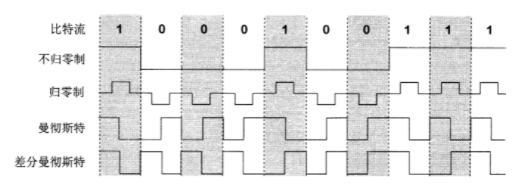

* **奈氏准则**：信号中高频分量往往不能通过信道，在传输中衰减（码间串扰），规定了在*理想低通（没有噪声、带宽有限）*的信道中，极限码元传输速率2W波特，W是理想低通信号带宽。V表示有多少种不同的码元。（理想低通信道下极限数据传输速率=*2Wlog2V b/s*）

* **香农定理**：带宽受限且有白噪声干扰的信道的极限数据传输速率（信道极限数据传输速率*C=Wlog2(1+S/N) b/s*），W信道带宽，S信道传输信号平均功率，N信道噪声功率，信噪比=10lg(S/N) dB

## 三种交换

* 电路交换
  * 进行数据传输前，两个结点之间必须先建立一条专用（双方独占）的物理通信路径，该路径可能有多个中间节点，在通话全部时间内，通话的两个用户始终占用端到端的通信资源
  * 通信时延小，有序，没冲突，使用范围广，控制简单
  * 建立连接时间长，线路独占，灵活性差，难以规格化
* 报文交换
  * 存储转发方式，无需建立连接，动态分配线路，提高线路可靠性，提高线路利用率，提供多目标服务
  * 由于数据进入交换节点需要存储转发，引起转发时延
  * 对报文大小没有限制，需要网络节点有较大的缓存空间
* 分组交换
  * 存储转发方式，限制了每次传送数据块大小的上限，构成分组
  * 无建立时延，不需要预先建立一条专用通信线路，线路利用率高，简化了存储管理（相对于报文交换），加速传输，较少出错概率与重发数据量，适合计算机之间的突发式数据通信
  * 存在传输时延，需要传输额外信息量，数据包可能出现失序、丢失、重复分组，要对分组按编号进行排序等工作

## 介质与复用

* 复用的原因：一般情况下，通信信道带宽远远大于用户所需的带宽，使用信道复用技术可以提高信道利用率，共享信道资源，降低网络成本

* 传输介质：双绞线、同轴电缆、光纤、无线电、微波、红外线、激光
* 信道复用：频分复用、波分复用、码分复用
* 码分复用（码分多址CDMA）：每一个站分配的码片序列各不相同，且必须相互正交，规格化内积为0，自己的码片向量规格化内积都是1

# 数据链路层

## 使用点对点信道

* **封装成帧**：给数据添加首部和尾部，进行帧定界
* **透明传输**：不管什么字符都能放在帧中传输，不会找到错误的帧边界（字节填充：发送端的数据链路曾在数据中出现控制字符SOH、EOT、ESC前面插入转义字符ESC，在接受端数据链路层把数据送往网络层前删除这个插入的转义字符）
* **差错检测**：循环冗余校验CRC与生成多项式，具有纠错功能
* 对于通信良好的有线传输链路，数据链路层协议不使用确认和重传机制，通信质量较差时使用，此时数据链路层向上提供可靠传输服务

* 点对点协议PPP
  * **特点**：简单，封装成帧，透明，多种网络协议，多种类型链路，面向字节，提供差错检测，不纠错，只保证无差错接受，不可靠，不用序号和确认不只是多点线路，只支持全双工
  * 组成：一个将IP数据包封装到串行链路的方法（IP数据包就是数据，不超过最大传输单元MTU），一个用来建立、配置、测试数据链路连接的链路控制协议LCP，一套网络控制协议NCP
  * 字段意义：7E FF 03 两字节协议 信息部分（IP数据报） 使用CRC的帧检验序列FCS 7E
  * **字节填充**：*信息字段中的7E改为7D 5E，7D改为7D 5D（都是拆开中间加D5）*，小于20的改为7D +20H
  * 零比特填充，同步传输时，连续的5个1填入一个0
  * 工作状态：（P81）
    * 链路静止时，不存在物理层连接
    
    * 线路检测到载波信号，建立物理连接，线路变为建立状态
    
    * LCP开始配置协商，协商后进入身份鉴别状态，协商LCP失败链路静止
    
    * 如果鉴别成功或无需鉴别，进入网络状态，鉴别失败则链路终止
    
    * 采用NCP配置网络层，进入打开状态，进行数据传输
    
    * 传输完成或者鉴别失败，链路终止
    
    * LCP链路终止后回到链路静止
## 使用广播信号的数据链路层

  * 局域网数据链路层：网络为一个单位所拥有，地理范围和站点数目有限

  * 局域网具有广播功能，便于系统扩展演变，提高系统可靠性，可用性，生存性

  * 局域网特性：拓扑结构、传输介质、介质访问控制方式

  * 拓扑结构：星形、环形、总线型

  * 共享信道：静态划分、动态媒体接入控制（多点接入）（随机接入：碰撞冲突，受控接入：多点线路探寻）

  * 以太网标准：两个子层（逻辑链路控制LLC（已消失），媒体接入控制MAC）

  * 适配器：p83

  * **载波监听多点接入/碰撞协议CSMA/CD**
    
    * 先听后发，边听边发，冲突停发，随机重发
    * 以太网端到端往返时间称作2t争用期，冲突/碰撞窗口
    * 所有数据帧必须大于一个最小帧长，小于最小帧长的帧认为无效丢弃，小于的发出去要填充，最小帧长=总线传播时延×数据传输速率×2
    * **截断二进制数退避算法（确定碰撞后重传的时机）**：基本退避时间2t（具体争用期时间51.2us，512bit时间，对于10Mbit/s以太网，下同），定义k=[重传次数，10]，从[0,1, 2，3, ... , 2^k-1]整数随机取r，重传退避时间为2rt，传16次不成功认为网络拥挤，帧无法发出，抛弃帧并向高层报告出错
    * 强化碰撞：发送数据的站一旦发现碰撞，立即停止发送数据，继续发送32/48bit人为干扰信号
    * 帧间最小间隔9.6us，96bit时间，使刚刚收到数据帧的站接收缓存来得及清理，做好接收下一帧的准备
    * 过程
      1. 准备发送：适配器从网络层获得一个分组，加上以太网的首部和尾部，组成以太网帧，放入适配器的缓存中，发送之前检测信道
      2. 检测信道：如检测到busy，则不停检测，如检测到空闲，并在96bit时间内保持了信道空闲（帧最小间隔），就发送这个帧
      3. 发送过程中不停检测，网络适配器边发送边监听，要么发送成功（未检测到碰撞），要么检测到碰撞后停止发送，发送人为干扰信号，根据指数退避算法，等待r倍512bit时间回到步骤2继续检测，传16次不成功就停止重传并向上报错
      4. 以太网每发送完一帧，还需要暂时保留，如果争用期内检测出发生碰撞，还要推迟一段时间后再把这个暂时保留的帧重传一次
    * 集线器
    
  * *网桥的工作原理是什么？网桥与以太网交换机有何异同*

  * *交换式以太网的特点是什么？用它怎么构建虚拟 局域网？*

  * 以太网信道利用率
    * a=单程端到端时延t/帧的发送时间T0，要尽可能小
    * Smax=T0/(T0+t)=1/(1+a)
    * 以太网连线长度受到影响，以太网帧长不能太短
    
  * 以太网MAC层
    * **格式**（以太网V2标准DIX Ethernet V2）前导码8字节（7同步码10交替+1帧开始定界符）（这个其实不属于MAC帧内部），目的地址6字节，源地址6字节，类型2字节，IP数据包作为数据，校验码FCS（采用CRC，4字节），填充（*总长小于64需要填充，就是数据不能小于46*）
    
      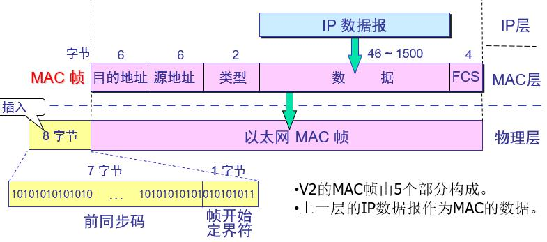

## 扩展的以太网

  * 物理层扩展
    * 使用光纤和光线调制解调器扩展主线和集线器距离
    * 一个学院三个系，系可以再用一个主干集线器组成更大的以太网。连起来之前，每一个系是一个独立地碰撞域，每一个时刻每一个碰撞域只能有一个站在发送数据，如果一个系以太网最大吞吐量10Mbit/s，三个系就是30，通过主干集线器互联后变成一个碰撞域，最大吞吐量是10（某系两个站通信，数据会通过所有集线器转发，其他系内部都不能通信）
    * 如果不同系用不同以太网技术，例如数据率不同，就不能用集线器互连
  * 链路层扩展
    * 网桥：对收到的帧根据其MAC帧的目的地址进行转发和过滤，受到帧后根据地址查找地址表，确定转发到哪一个接口或者把它丢弃
    * 交换式集线器（以太网交换机）：实质是多接口的网桥，全双工，同时连通多对接口，多对主机同时通信，相互通信的主机都是独占传输媒体，无碰撞地传输数据。有存储器缓存。有帧交换表通过自学习建立。具有多种速率的接口
    * 以太网交换机两种交换模式
      * 直通：只检查帧目的地址，速度快，缺乏智能性安全性，不支持不同速率端口交换
      * 存储转发式：先把帧缓存到高速缓存器，检查数据是否正确，五五查找表发送，有误丢弃。可靠性高，支持不同速率端口转换，延迟较大
    * 传统共享式以太网带宽10，10个用户，用户平均带宽为1，使用以太网交换机后虽然每个接口到主机带宽还是10，但由于一个用户在通信时独占而不是和其他网络用户共享传输媒体的带宽，对于拥有10个接口的交换机容量是100
  * 虚拟局域网
    * 利用以太网交换机实现，VLAN由一些局域网网段构成的与物理位置无关的逻辑组，而这些网段具有某些共同的需求，每一个VLAN的帧都有一个明确的标识符，指明发送这个帧的计算机属于哪一个VLAN
    * 限制了接收广播的计算机数量，使得计算机不会因传播过多消息而引起性能恶化（广播风暴）
    * VLAN标记放在MAC帧源地址字段和类型字段中间，四字节

# 网络层

## 网络层性质作用

* 网络层向上只提供简单灵活的、无连接的、尽最大努力交付的数据报服务，发送分组前不需要先建立连接，每一个分组（IP数据报）独立发送，与前后分组无关，不编号，网络层不提供服务质量的承诺

## IPv4

  * 地址表示：A类0开头8位网络号，B类10开头16位网络号，C类110开头24位网络号，ABC都是单播地址，D多播，E保留

  * 主机号全0是本网络本身

  * 主机号全1是本网络广播地址

  * 127.0.0.0环回自检，表示任意主机本身，目的地址位其的IP数据包不出现在任何网络

  * 0.0.0.0 本网络上的本主机

  * 255.255.255.255 本网络的广播地址

  * 128.0.0.0/192.0.0.0 不指派网络

  * 分级，IP地址管理机构在分配IP地址时只分配网络号，主机号由单位自行分配，同时路由器可以仅根据主机所连接的网络号来转发分组，路由表项目数大幅减少，见笑了路由表所占的存储空间和查找路由表的时间

  * IP地址是一台主机或者路由器和一条链路的接口，一个主机连接两个网络必须同时有两个IP地址，网络号必须不同，成为多归属主机，路由器总是有两个及以上的IP地址

  * 两个路由器直接相连时，两端接口处可以分配也可以不分配IP地址，分配了就是无名网络

  * 用转发器或者网桥连接起来的若干个局域网仍然是一个网络，这些局域网有相同的网络号，具有不同网络号的局域网必须使用路由器进行互连

  * 互联网同等对待每一个IP地址

  * 同一个局域网上的主机或路由器IP地址的网络号一致

##  IP地址与硬件地址

   * 物理地址是数据链路层和物理层使用的地址，IP地址是网络层和以上各层使用的地址，是一种逻辑地址，使用IP地址的IP数据报一旦交给数据链路层就被封装成MAC帧，MAC帧在传送使用的源地址和目的地址都是硬件地址
   * IP地址在IP数据报首部，MAC地址在MAC帧首部
        * 在IP层抽象的互联网上只能看到IP数据报
        * 虽然IP数据报有源地址，路由器只根据目的IP地址的网络号进行选择
        * 在局域网的链路层只能看到MAC帧

## 地址解析协议ARP

* ARP解决的是同一个局域网上的主机或路由器IP地址和硬件地址的映射的问题
* 原理是在主机ARP高速缓存中存放一个从IP地址到硬件地址的映射表，并且这个映射表还经常动态更新（新增或者超时删除）
* 过程
  * 如果在A的ARP高速缓存中查到主机B的IP地址，直接把硬件地址写入MAC帧，然后通过局域网把MAC帧发往硬件地址
  * 否则主机A自动运行ARP，在本局域网广播发送一个ARP请求分组，在本局域网上的所有主机上运行的ARP进程都收到此ARP请求分组
  * 如果主机B的IP地址与ARP请求分组中要查询的IP地址一致，收下这个ARP请求分组，并向主机A发送ARP响应分组，同时在这个ARP响应分组中写入自己的硬件地址（其余主机IP地址和ARP请求的IP地址不同，不响应）
  * ARP请求分组是广播发送，但是ARP响应分组是普通单播
  * 主机A收到主机B的ARP响应分组，就在其ARP高速缓存中写入主机B的IP地址到硬件地址的映射
  * 为了减少网络上的通信量，主机A在发送ARP请求分组时，把自己的IP地址到硬件地址的映射写入ARP请求分组，主机B收到时，把主机A的映射写入B自己的ARP高速缓存中。
  * ARP对保存在高速缓存中的每一个映射地址项目都设置生存时间，超过则删除
* ARP四种典型情况
  * 发送方是主机，把IP数据报发送给本网络另一主机，用ARP找到目的主机的硬件地址
  * 发送方是主机，把IP数据报发送给另一个网络的一台主机，用ARP找到本网络一个路由器的硬件地址，剩下的工作由这个路由器完成
  * 发送方是路由器，把IP数据报转发给本网络的一台主机，用ARP找到目的主机的硬件地址
  * 发送方是路由器，把IP数据报转发给另一个网络的一台主机，用ARP找到本网络一个路由器的硬件地址，剩下的工作由这个路由器完成

## IP数据报

* **首部格式**：*有20字节固定长度*（版本首部区分度，标识标志片位移，生存协议检验和，源地目的放最后）

  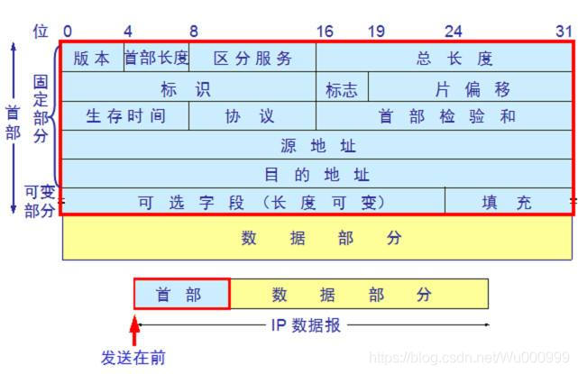

  * 版本（4位）IPv4就是4

  * 首部长度（4位）5是20字节（32位字×数，可20-60）

  * 区分服务（8位）

  * 总长度（16位）首部和数据之和的长度，单位字节

  * 标识（16位）

  * 标志（3位）

    * *MF，最低位，MF=1，后面还有分片，为0表示最后一个分片*
    * *DF，中间位，DF=0才允许分片*

  * 片位移（13位）*每个分片一定是8字节的整数倍，值是字节/8*

  * 生存时间（4位）

  * 协议（4位）

  * 首部检验和（4位）计算：IP首部循环加和取反，checksum置零

  * 源地址（4位）

  * 目的地址（4位）

  * （可选）

  * （填充）

    >**例题**
    >
    >**有一数据报总长度4820,字节，首部20字节，数据4800字节。某一网络能传送的数据报的最大长度是1420字节，该如何分片？画图，写出MF，DF，片偏移量**
    >
    >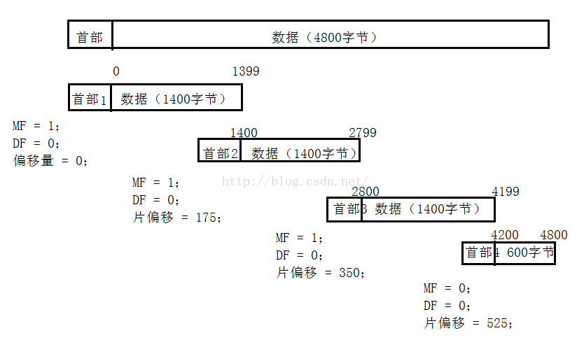

* IP层分组转发流程

  1. 数据报首部提取目的主机IP地址D，得到目的网络地址N
  2. 如果直接相连，直接交付
  3. 如果路由表有目的地址D的特定主机路由，传送给指明的下一条路由器
  4. 如果有到达网络N的路由，传送给指明的下一条路由
  5. 如果有默认路由，传送给指明的默认路由器
  6. 转发报告分组出错

## 划分子网与掩码

* **主机号、子网号全0全1**：RFC950子网号不能全0全1，RFC1878子网号可以全0全1，不论是哪种，子网中主机号全0全1的地址都不能被指派
* 相与得到子网网络地址

* 使用子网的分组转发
  1. 数据报首部提取目的主机IP地址D，得到目的网络地址N
  2. 对路由器直接相连的网络逐个检查，用各自网络子网掩码和D相与，查看结果是否匹配，匹配则直接交付，否则间接交付执行3
  3. 如果路由表中有目的地址D的特定主机路由，传送给指明的下一条路由器，否则执行4
  4. 对路由表每一行中子网掩码和D相与，结果为N，如果N和该行目的网络地址匹配。转发给该行下一条路由器，否则执行5
  5. 如果有默认路由，传送给指明的默认路由器，否则执行6
  6. 转发报告分组出错

>**例题**
>
>**某子网有 30 个节点要分配 IPv4 地址，最合适的子网掩码是**
>
>**A.255.255.255.192 B.255.255.255.248**
>
>**C.255.255.255.224 D.255.255.255.240** 
>
>
>
>2^5-2=2<30+1<2^6 = 64-2
>
>至少需要为路由器接口提供一个IP地址，即主机位至少有6位，A的主机位是6位，每个子网可以提供62个IP地址最合适(A)
>
>
>
>**某公司有 3 家子公司，每个子公司包含的主机数分别为 200、110、23。把202.16.134.0/23 的网段分配给每家子公司。要求从地址块的最小地址开始分配，给出地址利用率最高的分配方案，包括分配的每个地址块的最小地址、最大地址和掩码，给出剩余地址块。注意：必须给出解题过程。**
>
>
>
>202.16.134.0/23 用二进制表示 <u>202.16.1000011</u>0.00000000/23
>
>第一次划分
>
>2^7=128<200<2^8=256，主机号8位，前缀为24位
>
>所以把地址块202.16.134.0/23一分为二
>
><u>202.16.10000110</u>.00000000/24【202.16.134.0/24】分配给200台主机的子公司
>
>第二次划分
>
>2^6=64<110<2^7=12，主机号7位，前缀25位
>
>所以把地址块202.16.135.0/24一分为二
>
><u>202.16.10000111.0</u>0000000/25 【202.16.135.0/25】分配给 110 台主机的子公司
>
>第三次划分
>
>2^4=16<23<2^5=32，主机号5位，前缀27位
>
>所以把地址块202.16.135.128/25一分为四 
>
><u>202.16.10000111.1</u>***000***0000/27 【202.16.135.128/27】分配给 23 台主机的子公司
>
>202.16.10000111.1***010***0000/27【202.16.160.0/27】
>
>202.16.10000111.1***100***0000/27【202.16.192.0/27】
>
>202.16.10000111.1***110***0000/27 【202.16.224.0/27】
>
>（上述后两个地址块可以合并，前缀一样）
>
>**最终地址分配方案如下**
>
>分配给 200 台主机的子公司
>
>202.16.10000110.00000000/24 【202.16.134.0/24】 
>
>最小地址： 202.16.134.0 
>
>最大地址 202.16.134.255
>
>掩码： /24 
>
>分配给 110 台主机的子公司
>
>202.16.10000111.00000000/25 【202.16.135.0/25】
>
>最小地址： 202.16.135.0
>
>最大地址： 202.16.135.127
>
>掩码： /25
>
>分配给 23 台主机的子公司
>
>202.16.10000111.10000000/27 【202.16.135.128/27】
>
>最小地址： 202.16.135.128
>
>最大地址： 202.16.135.159
>
>掩码：/27
>
>剩下地址块
>
>202.16.10000111.10100000/27【202.16.160.0/27】
>
>202.16.10000111.11000000/26 【202.16.192.0/26】
>
>
>
>**设某路由器建立了如下路由表**
>
>   **目的网络           子网掩码         下一跳**
>
>**138.96.39.0     255.255.255.128   接口 0**
>
>**138.96.39.128 255.255.255.128   接口 1**
>
>**138.96.40.0     255.255.255.128    R2**
>
>**192.4.153.0     255.255.255.192    R3**
>
>   **（默认）                 -                R4**
>
>**现共收到 5 个分组，其目的站 IP 地址分别为：**
>
>**（1）138.96.39.10  （2）138.96.40.12** 
>
>**（3）138.96.40.15 （4）192.4.153.17** 
>
>**（5）168.96.40.11 试分别计算其下一跳。**
>
>
>
>（1）138.96.39.10 与 255.255.255.128 相与得 138.96.39.0，所以其下一跳为接口0
>（2）138.96.40.12 与 255.255.255.128 相与得 138.96.40.0，所以其下一跳为R2
>（3）138.96.40.151 与 255.255.255.128 相与得 138.96.40.128，所以其下一跳为默认路由R4
>（4）192.4.153.17 与 255.255.255.192 相与得 192.4.153.0，所以其下一跳为R3
>（5）168.96.40.11 与 255.255.255.128 和 255.255.255.192 相与都得 168.96.40.0，无对应目的网络项，所以只能按默认路由转发，其下一跳为R4

## 支持可变长子网划分和无分类域间路由选择CIDR

* CIDR 地址下的子网划分是对地址块的划分，只要是按照 2 的幂次来划分，并且每个地址块能够满足主机数量要求，就可以进行多次划分，并且不需要排除子网号为全0和全1的情况。*那主机号全0全1呢？（好像可以）*
* 路由聚合（构成超网）：CIDR地址块有很多地址，在路由表中利用CIDR地址块查找目的网络
* 最长前缀匹配，从匹配结果选取具有最长网络前缀的路由

## 网际控制报文协议ICMP

* 目的是为了更有效地转发IP数据报和提高交付成功的机会，用ICMP让主机或路由器报告差错和异常情况
* 属于网际层，不是高层协议，是IP层协议，ICMP报文装在IP数据报中，加上数据报首部组成IP数据报
* 报文种类

  * ICMP差错报告报文

    * 类型：终点不可达、时间超过、参数问题、改变路由（重定向）

    * 不应发送差错报告报文
      * 对ICMP差错报告报文不再发送
      * 对第一个分片数据报片的所有后续数据报片不发送
      * 对具有组播地址的数据报不发送
      * 对具有特殊地址的数据报不发送，如127.0.0.0等

  * ICMP询问报文

    * 类型：回送请求和回答，时间戳请求和回答

## 路由信息协议RIP（内部网关协议）

* 简单实现，开销较小
* 选择一条具有最少路由器的路由，也就是跳数最少，分布式的基于距离向量的路由选择协议
* 仅和相邻路由器交换信息
* 交换的信息是当前本路由所知道的全部信息，即自己现在的路由表（随着网络增大，开销增加，更新过程收敛时间过长）
* 按固定的时间间隔交换路由信息
* 限制了网络规模，适用小型互联网
* 每一个路由器不知道全网拓扑结构
* 传输协议是UDP
* 当网络出现故障时，要经过比较长的时间才能将信息传送到所有的路由器，两个路由到某网络的距离都为16时，才知道该网络不可到达，称为”好消息传播快，坏消息传得慢“
* 距离向量算法，对于每一个相邻路由器发送的RIP报文：
  * 地址为X的相邻路由器发来的RIP报文，修改报文中所有项目的Next改为X，Dist都加一
  * 如果原路由表Dest = N，添加
    * Dest != N，如果原路由表Next = X，替换
      * Next != N，如果原路由表Dis<报文Dis，更新
  * 三分钟没收到相邻路由器更新路由表，记为不可达，Dis=16
* RIP报文格式：P157

>**例题**
>
>**现在 B 收到其相邻路由器 C 发来的路由信息，请画出 B 更新后的路由表。 （1）写出 C 路由表修改情况（2）写出 B 路由表更新结果，给出更新后 B 路由表中每个条目的存在原因。**
>
>**C 的路由信息                 B 的路由表**
>
>**目的网络 距离        目的网络 距离 下一跳**      
>
>​    **N2        3               N1       1       -**
>
>​    **N3        2               N2       1       C**
>
>​    **N6        5               N3       4       D**
>
>​    **N9        4               N9       4        F**
>
>
>
>C 的路由更新                              B 的路由表更新
>
>目的网络 距离 下一跳    目的网络 距离 下一跳              原因
>
>​    N2        4       C            N1       1       -                  不变
>
>​    N3        3       C            N2       4       C    被时间更新的条目替代 
>
>​    N6        6       C            N3       3       C      被更短的下一跳替代
>
>​    N9        5       C            N6       6        C             新增条目
>
>​                                       N9       4        F             保持不变

## 开放最短路径优先OSPF（内部网关协议）

* 使用分布式的链路状态协议，而不是RIP那样的距离向量协议
* 向本自治系统中所有路由器发送信息（洪泛法）
* 发送的信息就是与本路由器相邻的所有路由器的链路状态，但这只是路由器所知道的部分信息
* 只有当链路状态发生变化时，路由器才向所有路由器用洪泛法发送此信息
* 能够用于规模很大的自治系统
* 每一个路由器都能建立链路状态数据库，也就是全网拓扑结构图
* 直接用IP数据报传送
* 允许管理员给每条路由指派不同的代价，对于不同类型的业务可计算出不同的路由，找出的是代价最低的路径
* 负载平衡：如果到同一个目的网络有多条代价相同的路径，那么可以将通信量分配给这几条路径

## 边界网关协议BGP（外部网关协议）

* BGP只力求寻找一条能够到达目的网络且比较好的路由，并非最好的，采用路径向量路由选择协议。和距离向量协议和链路状态协议有很大的区别，BGM是应用层协议，基于TCP
* 工作原理：每个自治系统管理员至少选择一个路由器作为该自治系统的BGP发言人，一个BGP发言人和其他自治系统的BGP发言人交换路由信息之前，建立TCP连接（BGP报文是TCP报文的数据部分），在此连接上交换BGM报文，建立BGP会话，利用BGP会话交换路由信息，所有BGP发言人都相互交换网络可达性的信息后，各BGP发言人就可以找出到达各个自治系统较好路由
* 每个BGP发言人需要运行BGP，也要运行自治系统内部网关协议如PSPF或者RIP
* BGP刚运行时，BGP邻站交换整个BGP路由表，以后只需要在发生变化的时候更新变化的部分，节省网络带宽和处理开销

## IPv6

* 紧凑写法：域中前导零可去掉，一个域至少有一个数字，相继0域可缩写，双冒号只出现一次
* IPv4向IPv6过渡
  * 双协议栈：在完全过渡到IPv6之前，使一部分主机或路由器装有双协议栈（一个IPv4和一个IPv6）双协议栈主机或路由器既能和IPv6系统通信，又能和IPv4的系统通信，具有两种IP地址
  * 隧道技术：IPv6数据报要进入IPv4网络时，把IPv6数据报封装成IPv4数据报，整个IPv6数据报成为IPv4数据报数据部分，当数据离开IPv4网络中的隧道时再把数据报部分交给主机的IPv6协议栈

## 虚拟专用网VPN与网络地址转换NAT

* 一些专用地址，这些地址只能用于一个机构的内部通信，不能用于和互联网上的主机通信，互联网中所有路由器对于目的地址是私有地址的数据包一律不进行转发
* VPN是为本机构主机用于机构内部通信，不是用于和网络外非本机构的主机通信，如果专用网不同网点之间的通信必须经过公用的互联网又有保密要求，那么所有通过互联网传送的数据都必须加密
* 一个机构两个场所通过公用互联网构成一个VPN，每一个场所需要至少一个路由器具有合法全球IP地址，路由器在专用网内部网络接口地址则是专用网本地地址
* NAT通过将专用网络地址转换为公用地址，从而对外隐藏内部管理的IP地址，使得整个专用网只需要一个全球IP地址就可以与互联网连通，专用网本地IP地址可以重用，NAT大大节省了IP地址的消耗，也降低了内部网络受到攻击的风险

## 网络层设备

* 路由器，功能是路由选择，分组转发

# 运输层

## 运输层概述

* 网络层为主机之间提供逻辑通信，运输层为应用进程之间提供端到端的逻辑通信，运输层还要对报文进行差错检测，还能对发送方不同应用进程使用同一传输层协议传送数据（复用），接收方运输层剥去报文首部后把数据正确交付到目的应用进程（分用）
* 端口
  * **概念作用**：在运输层使用协议端口号，是软件端口，是*应用层的各种协议进程与运输实体进行层间交互的一种地*址，端口号只具有本地意义，只是为了标志计算机应用层各个进程在和运输层交互的层间接口
  * **分类**：由于计算机通信采用客户服务器方式，端口分为*服务器端使用的端口号*（*熟知端口号，又叫系统端口号，还有登记端口号*），*客户端使用的端口号*（*短暂端口号*，仅在客户进程运行时才动态选择）
* 运输层有面向连接的TCP和无连接的UDP两种运输协议，不同时实现

## 用户数据报协议UDP

* 无连接

* 尽最大努力交付

* 面向报文

* 没有拥塞控制

* 支持一对一、一对多、多对一、多对多交互通信

* 首部开销小

* UDP通信用到了端口号，但是不需要使用套接字建立连接

* 首部格式*（前面八个字节）*

  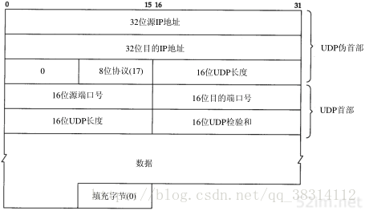

## 传输控制协议TCP

* 提供面向连接的运输层协议

* 每一条TCP连接只能由两个端点，每一条TCP连接只能是点对点的，叫套接字或者插口，每一条TCP连接唯一地被通信两端的两个端点所确定

* 提供可靠交付服务

* 提供全双工通信

* 面向字节流（流入到进程或从进程流出的字节序列），TCP把应用程序交下来的数据仅仅看成是一连串无结构的字节流

* **首部格式**：*有20字节固定长度*

  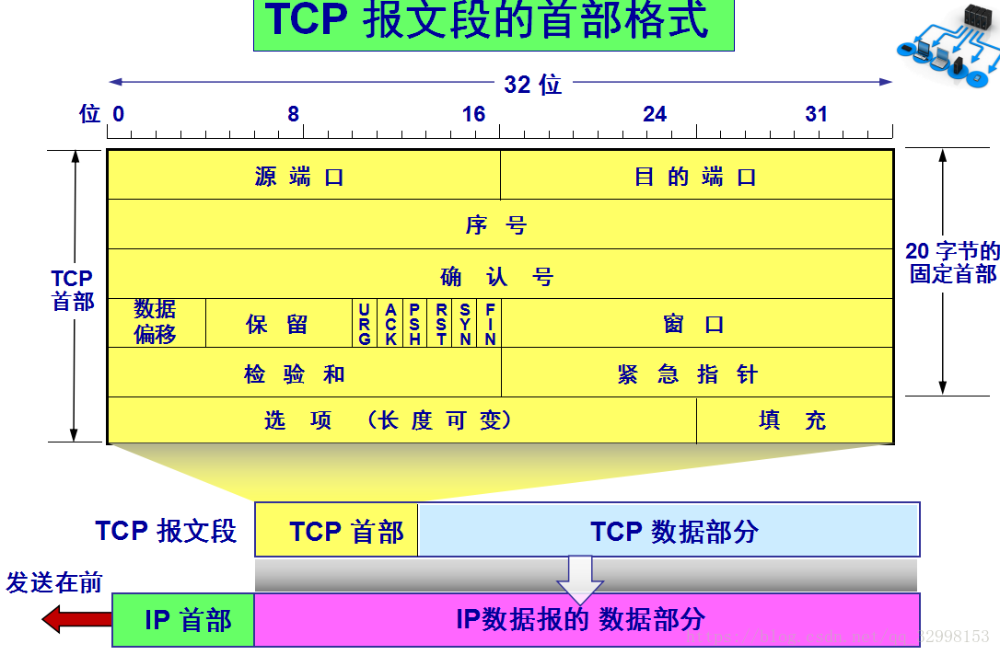

  * 源端口（2字节）
  * 目的端口（2字节）
  * 序号（4字节）报文段序号
  * 确认号（4字节）期望对方下个报文段第一个数据字节的序号
  * 数据偏移（4位）实际上是指出TCP报文段的首部长度
  * 保留（6位）保留为今后使用，但目前应置为0 
  * URG（1位）相当于高优先级
  * ACK（1位） 仅当ACK=1时确认号字段才有效，当ACK=0时确认号无效。TCP规定，在连接建立后所有的传送的报文段*都必须把ACK置为1*
  * PSH（1位）尽快推送交付接收应用进程
  * RST（1位）表明TCP连接中出现了严重错误
  * SYN（1位）在连接建立时用来同步序号
  * FIN（1位）表明此报文段数据已发送完毕，要求释放运输连接
  * 窗口（2字节）允许对方发送的数据量
  * 检验和（2字节）伪首部的格式和UDP用户数据报的伪首部一样。但应把伪首部第4个字段中的17改为6（TCP的协议号是6）；把第5字段中的UDP中的长度改为TCP长度。
  * 紧急指针（2字节）紧急数据的字节数，即使窗口为0时也可以发送紧急数据
  * （选项）
  * （填充）

## TCP三次握手四次挥手

* **三次握手**
  
  * 建立连接前，服务器进程LISTEN（收听）状态，等待客户的连接请求
  
  * 客户机TCP首先向服务器的TCP发送一个连接请求报文段。这个特殊的报文段中不含应用层数据，其首部中的SYN标志位被置为1，随机选择一个起始序号seq=x。SYN报文不携带数据，但要消耗一个序号
  
  * 服务器的TCP收到连接请求报文段之后，如果同意建立连接，就向客户机发回确认，并为该TCP连接分配TCP缓存和变量。在确认报文段中，SYN和ACK位都被置为1，确认号ack=x+1，并且服务器随机产生起始序号seq=y，确认报文段同样不包含应用层数据，但要消耗一个序号。TCP服务器进入SYN-RCVD（同步收到）
  
  * 当客户机收到确认报文段之后，还要向服务器给出确认，并且也要给连接分配缓存和变量。这个报文段的ACK标志位被置为1，序号seq=x+1，确认号ack=y+1，该报文段可以携带数据，若不携带数据则不消耗序号。TCP客户端进入ESTABLISHED（已建立连接）
  
    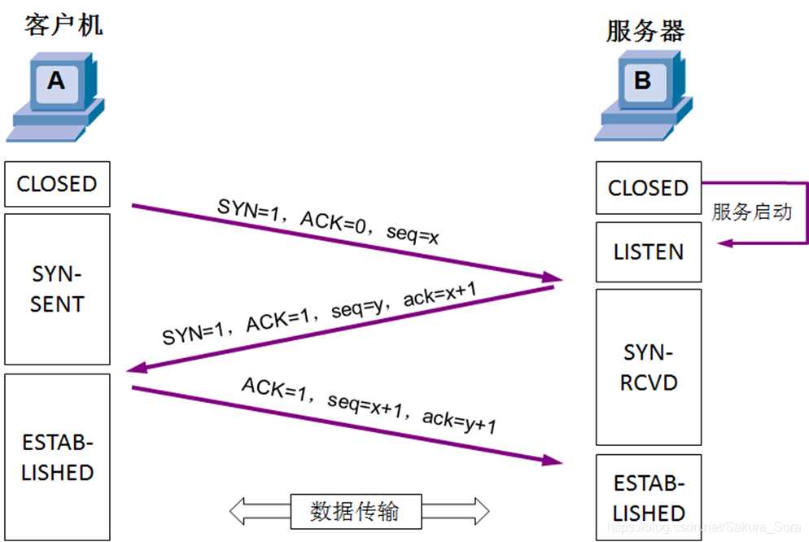
  
* **四次挥手**
  
  * 客户机打算关闭连接时，向其TCP发送一个连接释放报文段，并停止发送数据，主动关闭TCP连接，此时FIN=1，seq=u（等于前面已经传送过的数据序号+1），发送FIN报文时，不携带数据也消耗一个序号。TCP客户进程进入FIN-WAIT-1（终止等待1）
  
  * 服务器收到连接释放报文段后立即发出确认，ACK=1，seq=v（等于前面已经传送过的数据序号+1），服务器进入CLOSE-WAIT（关闭等待）此时客户机到服务器这个方向连接已释放，TCP连接处于半关闭状态。但服务器若发送数据，客户机仍要接收，即从服务器到客户机这个方向的连接并未关闭
  
  * 若服务器已经没有要向客户机发送的数据，就通知TCP释放连接此时FIN=1，seq=w（半关闭前服务器可能又发送了一些数据），还需要重复上次的确认号ack=u+1。服务器进入LAST-ACK（最后确认）
  
  * 客户机收到连接释放报文段后，必须发出确认。ACK=1，确认号ack=w+1，序号seq=u+1，此时TCP连接还未释放，必须经过时间等待计时器设置的时间2MSL（最长报文段寿命）后，客户端进入CLOSED（连接关闭）
  
    
  
  >**例题**
  >
  >**用TCP传送512字节的数据，设窗口为100字节，而TCP报文段每次也是传送100字节的数据。再设发送端和接收端的起始序号分别选为100和200。试画出工作示意图，从连接建立阶段到连接释放都要画上。**
  >
  >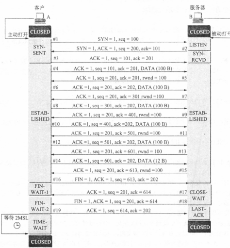

## 可靠传输工作原理

* 停止等待协议

  * 无差错情况

  * 在出现差错时超时重传，每发送完一个分组设置一个超时计时器

    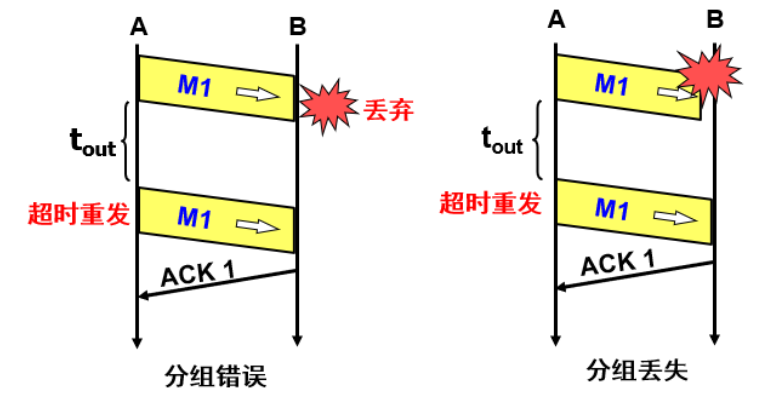

  * 发送完一个分组后，必须暂时保留已发送分组的副本，收到相应确认后才能清除

  * 分组和确认分组必须进行编号

  * 超时计时器设置重传时间应当比数据在分组传输的平均往返时间更长一些（过长通信效率低，过短产生不必要的重传浪费网络资源）

  * 确认丢失，要丢弃这个重复的分组，不向上层交付，然后向发送方发送确认

  * 确认迟到，原发送方收到确认但什么也不做，收下就丢弃，接收方仍然受到重复数据，同样丢弃重复数据，重传确认分组给发送方

    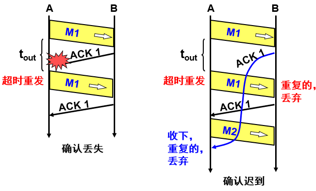

  * 信道利用率较低，U=TD/(TD+RTT+TA)=(L/C)/T，T发送的比特数据，C使数据传输率，T是开始发送到接收到ack的周期

  * 信道吞吐量=信道利用率×发送速率（信道带宽）=发送的数据/网络时延（发送和往返时间）

    >**例题**
    >
    >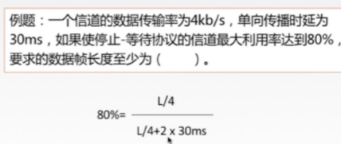

* 连续ARQ协议与滑动窗口

  * 连续ARQ，发送方每收到一个确认，就把发送窗口向前滑动一个分组的位置，接收方一般是累积确认，不必对收到的分组逐个发送确认，对按序到达的最后一个分组发送确认

  * 优点是容易实现，即使确认丢失也不必重传，缺点是不能向发送方反映出接收方已经正确收到所有的分组的信息

  * 回退N的情况需要退回来重传已发送过的N个分组，通信线路质量不好时具有负面影响

  * 以字节为单位的滑动窗口

    >**例题**
    >
    >**若采用滑动窗口机制对于两个相邻接点A（发送方）和B（接收方）的通信过程进行流量控制。假 定帧的序号长度为3个二进制位，发送窗口和接受窗口的大小都是7，当A发送了编号为0、1、2、3这4个帧后，而B接受了这4个帧，但仅应答了0、1两个帧。请问：此时，A的发送窗口将要发送的帧序号 为哪些？此时，B的接收窗口内可能的最大帧序号为多少？**
    >
    >（1）如果未发生超时，4、5、6、7、0是将要发送的帧。 
    >
    >（2）如果发生了超时，则2、3将会重传，那么将要发送的帧序号为 2、3、4、5、6、7、0 此时，3是A已经发送出去的最大帧序号，因此，B的接收窗口内可能的最大帧序号为3

* **超时重传时间的确定**

  * 加权平均往返时间RTT_S=(1-a)(旧的RTT_S)+a(新的RTT样本)
  * 超时重传时间RTO=RTT_S+4RTT_D
  * RTT偏差加权平均值RTT_D=(1-b)(旧的RTT_D)+b|RTT_S-新的RTT样本|
  * 计算RTT_S只要报文段重传了，就不采用其往返时间样本

* 选择确认SACK

* 滑动窗口实现的流量控制

  * 让发送方发送速率不要太快，让接收方来得及接受

  * 发送窗口不能超过接受窗口大小
  * 糊涂窗口综合征：接收方缓存已满，应用进程一次只从接收缓存读取一个字节，然后向发送方确认，把窗口设置成一个字节，发送方发来一个字节数据，接收方发挥确认，窗口为一个字节，网络效率低。解决方法是可以让接受方等待一段时间，使得接收缓存已有足够空间容纳一个最长的报文段，或者等到接收缓存已有一半空闲的时间

* 拥塞控制

  * 拥塞条件：Σ对资源的需求>可用资源
  
  * 目的：防止过多的数据注入到网络中，这样可以使网络中的路由器或链路不致过载
  
  * **和流量控制的异同**：都是为了提高网络性能。而流量控制是*点对点*通信量的控制，解决的是*发送方和接收方速率不匹配*的问题，采用的机制是*滑动窗口*的机制。拥塞控制是*全局性*的过程。拥塞控制解决的是避免*网络资源被耗尽*的问题。（全局局部，解决的问题，控制方法）
  
  * **控制方法**
    
    * *慢开始*（主机开始发送数据时先探测，由小到大逐渐增大拥塞窗口数值，每经过一个轮次，拥塞窗口加倍），*拥塞避免*（让拥塞窗口缓慢增大），*快重传*，*快恢复*
    * cwnd加倍
    * cwnd<=ssthresh慢开始，cwnd加倍
    * cwnd>=ssthresh拥塞避免，cwnd加一
    * *网络拥塞超时时，ssthresh=cwnd/2，cwnd=1，慢开始*
    * *连续收到3个重复确认后进行快重传，之后开始快恢复，ssthresh=cwnd/2，cwnd=ssthresh*
    
    >**例题**
    >
    >**设TCP 的ssthresh的初始值为8(单位为报文段)。当拥塞窗口上升到12时该网络发生了超时，TCP使用慢开始和拥塞避免。 试分别求出第1次到第15 次传输的各拥塞窗口大小并说明拥塞控制窗口每一次变化的原因。**
    >
    >
    >
    >n  cwnd     n   cwnd       n  cwnd
    >
    >1     1        6      10        11    4
    >
    >2     2        7      11        12    ***6***
    >
    >3     4        8      ***12***        13    7
    >
    >4     ***8***        9       1         14    8
    >
    >5     9       10       2         15    9     (在n=12之后，门限=6)
    >
    >
    >
    >**设TCP 的ssthresh的初始值为8(单位为报文段)。 采用Reno TCP拥塞控制方法，当拥塞窗口上升到12时收到3个重复的确认，在第13次传输后发生了超时，试分别求出第1次到第15次传输的各拥塞窗口大小，给出不同算法的执行阶段，说明不同阶段的 ssthresh门限值的大小。**
    >
    >
    >
    >n  cwnd     n   cwnd       n  cwnd
    >
    >1     1        6      10        11    8
    >
    >2     2        7      11        12    9
    >
    >3     4        8      ***12***        13    ***10***
    >
    >4     ***8***        9       6         14    1      (在n=12之后，门限=6)
    >
    >5     9       10       7         15    2      (在n=13之后，门限=5)

# 应用层

## 域名系统DNS

* DNS把互联网主机名字转换为IP地址，是分布式系统
* 域名结构：国家顶级域名，通用顶级域名，基础结构域名arpa（反向域名）
* 域名服务器
  * 一个服务器有权限的范围叫做区，每一个区设置相应的权限域名服务器，用来保存该区中的所有主机的域名到IP地址的映射，区是域的子集
  * 分类
    * 根域名服务器：最高层，最重要，所有的根域名服务器都知道所有的顶级域名服务器的域名和IP地址（本地域名服务器在无法解析域名时，首先求助于根域名服务器，根域名服务器并不直接把待查询结果域名转换为地址，根域名服务器也不存储这种信息，而是告诉本地域名服务器下一步应当找哪一个顶级域名服务器进行查询）
    * 顶级域名服务器：管理该顶级域名服务器注册的所有二级域名
    * 授权域名服务器：每台主机都必须在授权域名服务器登记
    * 本地域名服务器
* 解析过程
  * 主机向本地域名服务器的查询一般都采用递归查询：如果主机询问的本地域名服务器不知道被查询域名的IP地址，本地域名服务器以DNS客户身份向其他根域名服务器继续发出查询请求报文，替代主机查询，不是让主机自己进行查询，递归查询结果是IP地址或者报错
  * 本地域名服务器向根域名服务器的查询通常采用迭代查询：根域名服务器收到本地域名服务器，要么给出IP地址，要么告诉本地域名服务器去哪个顶级域名服务器查询，然后本地域名服务器向这个顶级域名服务器进行后续查询，顶级域名服务器要么给出IP地址，要么告诉本地域名服务器去哪个权限域名服务其，最后知道IP地址后返回给发起查询的主机。

## 文件传输协议FTP

* 只提供文件传输的一些基本服务，使用TCP可靠的运输服务，主要功能是减少或消除在不同操作系统下处理文件的不兼容性
* 采用客户服务器方式，一个FTP服务器进程可同时为多个客户进程提供服务，FTP服务器由接受新的请求的主进程和负责处理单个请求的若干从属进程组成
* 主进程工作步骤
  1. 打开熟知端口21（控制），使客户进程能够连接上
  2. 等待客户进程的连接请求
  3. 启动从属进程处理客户进程发来的请求，主进程和从属进程并发进行，从属进程对客户进程的请求处理完毕后立即终止
  4. 回到等待状态，接收其他客户进程的请求

## 远程终端协议TELNET

* TELNET定义了数据和命令如何通过互联网，这些定义是网络虚拟终端NVT

## 万维网WWW与HTTP

* WWW是大规模、联机式的信息储藏所，用链接的方法从互联网一个站点到另一个站点，主动按需获取信息。是分布式超媒体系统，是超文本系统的扩充
* WWW以客户服务器方式工作，客户程序向服务器程序发出请求，服务器程序向客户程序送回客户所需要的WWW文档
* 统一资源定位符URL
  * <协议>://<主机>:<端口>/<路径>
  * 使用HTTP的URL默认端口80可省略
* 超文本传输协议HTTP
  * 定义浏览器怎样向WWW服务器请求WWW文档，以及服务器怎样把文档传给浏览器
  
  * 面向事务的应用层协议
  
  * 工作过程：WWW网点的服务器进程不断监听TCP端口80，以便发现是都有浏览器向它发出建立请求。一旦监听到并建立了TCO连接，浏览器就向万维网服务器发出浏览某个页面的请求，服务器就返回所请求的页面作为想要，最后TCP连接被释放
  
  * 使用面向连接的TCP协议，保证数据可靠传输，但是HTTP本身无连接，HTTP是无状态的
  
  * 请求一个WWW文档所需时间是文档传输时间+2RTT
  
  * HTTP/1.0：缺点是每请求一个文档就要有两倍RTT开销，另一种开销是客户和服务器每建立一次新的TCP连接都要分配缓存和变量，特别是服务器往往同时服务大量客户请求，非持续连接使得WWW服务器负担重
  
  * HTTP/1.1：使用持续连接，在服务器发送响应后仍然在一段时间保持连接，使同一个浏览器和该服务器可以继续在这条连接上传送后续的HTTP请求报文和响应报文。持续连接工作方式有非流水线（收到前一个响应后才能发出下一个请求，和非持续连接相比节省一个RTT时间）和流水线方式（在收到HTTP响应报文之前就能接着发送新的请求报文）
  
  * 代理服务器（万维网高速缓存），校园网使用代理访问过程
    1. 校园网计算机中的浏览器访问互联网的服务器请求服务时，就先和校园网的代理服务器建立TCP连接，并向代理服务器发出HTTP请求报文
    2. 若代理服务器已经存放了所请求的对象，代理服务器就把这个对象放入HTTP响应报文中返回给计算机的浏览器
    3. 否则，代理服务器就代表发出请求的用户浏览器，与互联网上的源点服务器建立TCP连接，并发送HTTP请求报文
    4. 源点服务器把所请求的对象放在HTTP响应报文中返回给校园网的代理服务器
    5. 代理服务器收到这个对象后，先复制在自己的本地存储器中（留待下次用），然后再把这个对象放在HTTP响应报文中，通过已建立的TCP连接，返回给请求该对象的浏览器。
    
  * **HTTP报文（P271）方法**
  
    
* 超文本标记语言HTML
* 动态万维网文档（P276）
* 活动万维网文档（P278）

## SMTP、POP3与IMAP

* 一个电子邮件系统有三个主要组成构建：用户代理，邮件服务器，以及邮件发送协议（如SMTP）和邮件读取协议（如POP3）
* 用户代理UA：用户和电子邮件系统的接口，又称电子邮件客户端软件，具有撰写、显示、处理、通信功能
* 发送方邮件服务器充当服务器和客户，接收方邮件服务器充当服务器
* 收发过程
  1. 发件人编写好邮件内容。然后把邮件通过SMTP协议发送给发送方的邮件服务器
  2. SMTP服务器收到用户发来的邮件后，就把邮件临时存放在邮件缓存队列中，等待发送到接收方的邮件服务器中
  3. 发送方邮件服务器SMTP客户与接收方邮件服务器的SMTP服务器建立TCP连接，然后就把邮件缓存队列中的邮件依次发送出去，所有邮件发完后，关闭所建立的TCP连接
  4. 运行在接收方邮件服务器中的SMTP服务器进程收到邮件后，把邮件放入收件人用户邮箱中，等待收件人进行读取；
  5. 收件人在打算收信时，就运行计算机中的用户代理，使用POP3或者IMAP协议读取发送给自己的邮件。
* SMTP
* POP3与IMAP

## 动态主机配置DHCP

* 动态主机配置协议，称为即插即用连网。这种机制允许一台计算机加入新的网络和获取IP地址而不用手工参与。需要IP地址的主机在启动时就向DHCP服务器广播发送发现报文，这时该主机就成了DHCP客户。发送广播报文是因为现在还不知道DHCP服务器在什么地方，因此要发现DHCP服务器的IP地址。这样，本网段的所有主机都能够收到这个广播包，但是只有DHCP服务器才能对此广播包进行回答。DHCP服务器先在其数据库中查找该计算机的配置信息。若找到，则返回找到的信息。若找不到，则从服务器的IP地址池中取一个地址分配给该计算机。DHCP服务器的回答报文叫做提供报文，提供了IP地址等配置信息。
* DHCP服务器分配给DHCP客户的IP地址是临时的，因此DHCP客户只能在一段有限的时间内使用这个分配到的IP地址。DHCP协议称这段时间为租用期，这个数值由DHCP服务器自己决定。当租用期过半，DHCP客户还要发送请求更新租用期。

* 过程
  1. DHCP服务器被动打开UDP端口67，等待客户端发来的报文。
  2. DHCP客户从UDP端口68广播发送发现报文DHCPCOVER（目的IP地址置为全1，源IP地址设为全0）。
  3. 只有DHCP服务器对此报文进行回答。凡收到DHCP发现报文的DHCP服务器都发出DHCP提供报文DHCPOFFER，因此DHCP客户可能收到多个DHCP提供报文。DHCP服务器先在其数据库中查找该计算机的配置信息，若找到则返回找到的信息，若找不到，则从服务器的IP地址池中选取一个地址分配给该计算机。
  4. DHCP从几个DHCP中选择其中的一个，并向所选择的DHCP服务器发送DHCP请求报文DHCPREQUEST。
  5. 被选择的DHCP服务器发送确认报文DHCPACK。从这时起，DHCP客户端的IP地址和硬件地址已经完成绑定，并且可以开始使用得到的临时IP地址了。DHCP客户端现在要根据服务器提供的租用期T设置两个计时器T1和T2，它们的超时 时间分别是0.5T和0.875T。
  6. 租用期过了一半（T1时间到），DHCP客户发送请求报文DHCPREQUEST要求更新租用期。
  7. DHCP服务器若同意则发送确认报文DHCPACK。DHCP客户得到新的租用期，重置计时器。
  8. DHCP服务器若不同意，则发送否认报文DHCPNACK。这时DHCP必须立即停止使用原来的IP地址，而必须重新申请IP地址（回到步骤2）。若DHCP服务器不响应步骤6的请求报文，则在租用期过了87.5%时（T2时间到），DHCP必须重新发送请求报文（重复步骤6），然后又重复后面的步骤。
  9. DHCP可以随时提前终止服务器所提供的租用期，这时只需向DHCP服务器发送释放报文DHCPRELEASE即可。

